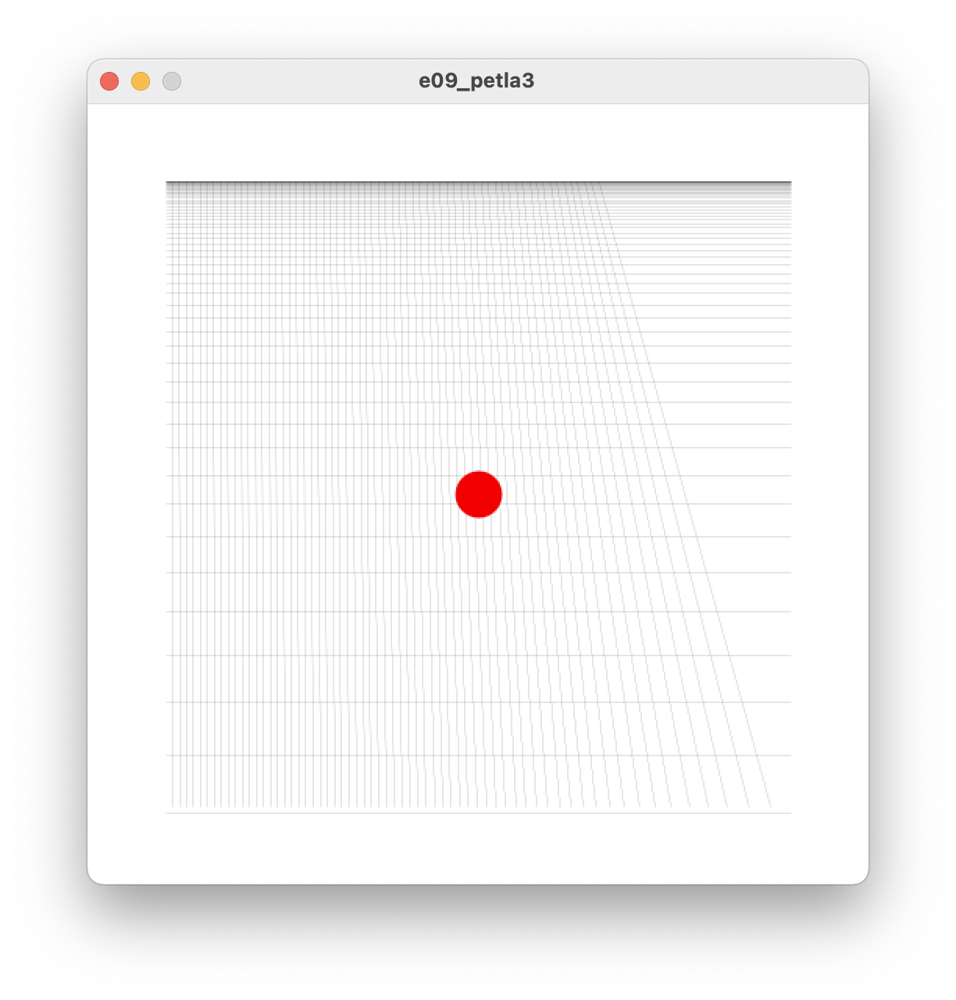
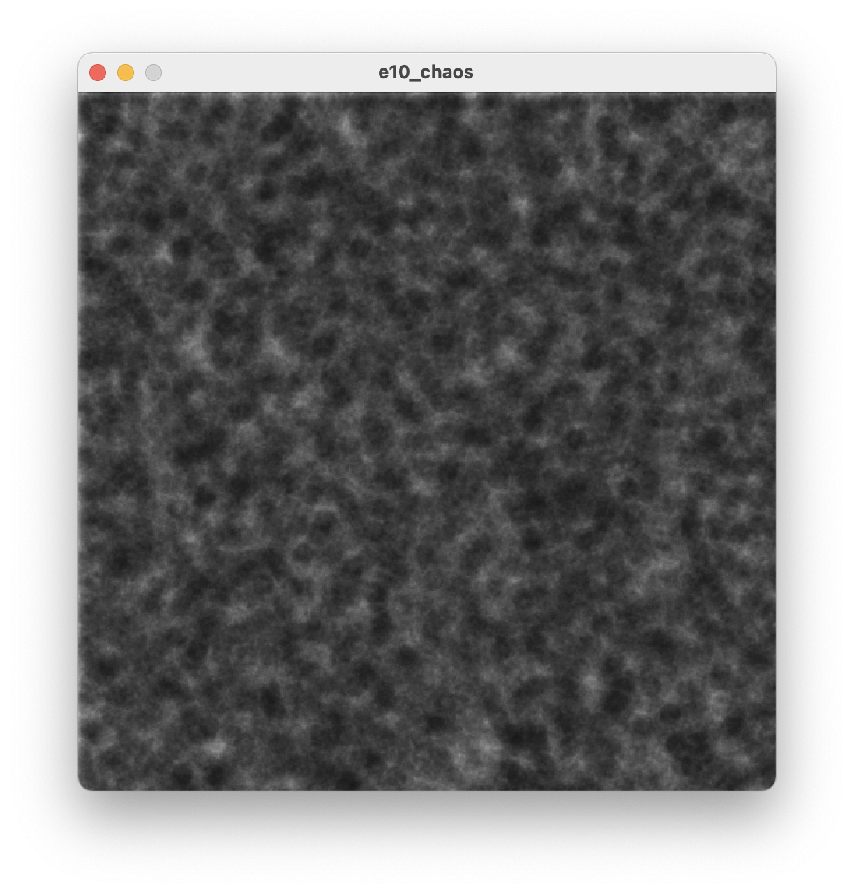

# Sezon 01 - mój pierwszy piksel

## Processing

- punkty, kolor i grubość obrysu, linia, prostokąt, elipsa, wypełnienie.
- zmienne, czyli jak tworzyć pudełka do przechowywania zmieniających się wartości na przykładzie przechowywania koloru i liczb. 

```Processing
int n = 1; // deklaracja zmiennej o nazwie n do przechowywania liczby całkowitej i włożenie do niej na początek liczby 1.
float waga = 15.3; // deklaracja zmiennej o nazwie waga do przechowywania liczby rzeczywistej i włożenie do niej na początek liczby 15.3.
waga = waga + 1.5; //zwiększenie wagi o jeden i pół.
n++; // zwiększenie zmiennej n o jeden. Już wiecie czemu C++
```

- Pętla, czyli powtarzanie określoną liczbę razy, albo dla podanego warunku, a czasami w nieskończoność :). POniżej przykład powtarzania pod warunkiem, że n jest mniejsze od 100.

```Processing
while(n < 100) 
{
  …
  n++;
} 
```

### zmienne wbudowane w procesing:

- `width` szerokość okna (ile kolumn).
- `height` wysokość okna (ile wierszy).
 
### typy zmiennych: 

- `float` liczby rzeczywiste (mogą mieć coś tam po przecinku ;) np. 3.14) 
- `void` liczby całkowite (…, -2, -1, 0, 1, 2, …)

### instrukcje: 

```processing
size(800, 600); // Rozmiar okna 800x600
background(255); // Kolor tła
stroke(150, 120, 34); // kolor obrysu
fill(#E2A1CC); //kolor wypełnienia 
strokeWeight(15); // grubość obrysu
point(50,70); // punkt w kolumnie 50 i wierszu 70
line(30, 10, 200, 400); // linia między punktami (30, 10) i (200, 400)
ellipse(50, 30, 200, 60); // ellipsa o środku w (50, 30), szerokośći 200 i wysokości 60
saveFrame(); // zapisuje na dysku aktualną klatkę anikacji
random(100); // pseudo losowość :) chaos rządzi, tu losuje od zera do 100. 
```

## Zadanie domowe

Proszę obejrzeć: http://hello.processing.org

## Materiały pomocnicze

- Color
https://processing.org/tutorials/color/
- Coordinate System and Shapes
https://processing.org/tutorials/drawing/

## Ekrany

Mój pierwszy piksel `point(50, 50);`


Eksperymenty z zapętlaniem `while(wiersz < height) { … }` 



Chaos rządzi `random(1000);`

