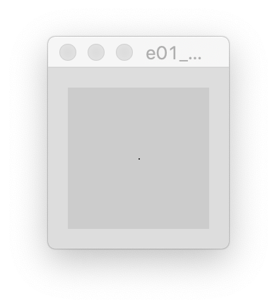

# Sezon 01 - mój pierwszy piksel

## Prezentacja

- Każdy może kodować!
- Szkoła i efekt [wyuczonej bezradności](https://pl.wikipedia.org/wiki/Wyuczona_bezradność)
- Kod w sztuce, nauce, designie, społeczeństwie

## Processing

- punkty, kolor i grubość obrysu, linia, prostokąt, elipsa
```processing
size(800, 600); // Rozmiar okna 800x600
background(255); // Kolor tła
stroke(150); // kolor obrysu
strokeWeight(15); // grubość obrysu
point(50,70); // punkt w kolumnie 50 i wierszu 70
line(30, 10, 200, 400); // linia między punktami (30, 10) i (200, 400)
ellipse(50, 30, 200, 60); // ellipsa o środku w (50, 30), szerokośći 200 i wysokości 60
```

## Zadanie domowe

Proszę obejrzeć: http://hello.processing.org

## Materiały pomocnicze

- Color
https://processing.org/tutorials/color/
- Coordinate System and Shapes
https://processing.org/tutorials/drawing/

## Ekrany

Mój pierwszy piksel `point(50, 50);`

