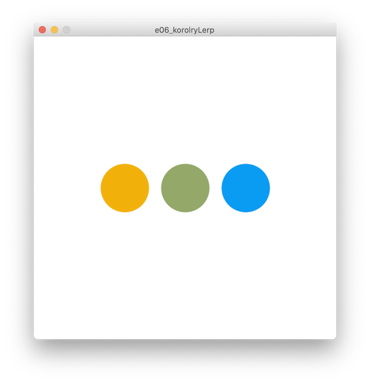
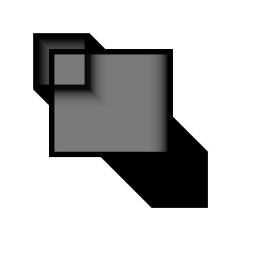

# Sezon 02 - animacja i szum

## Processing
- Kolory w trybie HSB (barwa, nasycenie, jasność)
- Co zrobić żeby mieć ruchomy obraz

```Processing
void setup() 
{
  //tu piszemy co ma być raz na starcie programu
}
void draw() 
{
  //tu co ma się powtarzać z prędkością frameRate
}
```
- Reakcja na wciskanie klawiszy

```Processing
void keyPressed() {
  //tu co ma się stać kiedy naciśniemy dowolny klawisz 
}
```

- Warunkowe wykonanie wybranych instrukcji. Wykonują się jeżeli podany warunek jest spełniony.

```Processing
if(frameCount == 180) 
{
  // to co napiszemy tutaj, 
  // wykona się jak numer klatki będzie równy 180
}
// to co napiszemy tu już nie podlega powyższemu warunkowi
```

### zmienne wbudowane w procesing:
- `frameCount` to zmienna licznik klatek, po każdej klatce animacji zwiększa się o jeden.
- `mouseX` to aktualna pozycja kursora myszy w poziomie.
- `mouseY` to aktualna pozycja kursora myszy w pionie.
 
### typy: 
- `color` zmienna tego typu może przechowywać informacje o kolorze
```Processing
color kolorFajny = #F188A1; //deklaracja zmiennej o nazwie kolorFajny służącej do przechowywania koloru i włożenie do niej koloru określonego stałą #F188A1
…
stroke(kolorFajny); //użycie wcześniej określonego koloru
```

### instrukcje: 
- `colorMode(HSB);` zmienia tryb kolorów na Hue, Saturation, Brightness
- `lerpColor()` płynne przejście pomiędzy kolorami
- `noise()` losowość jak w naturze.
- komentarz jednej linii 

```Processing
// wstawianie komentarzy żebyśmy pamiętali o co chodoziło
// background(255) - albo do wyłączania instrukcji na chwile bez kasowania z tekstu program
```

## Zadanie domowe

Stworzyć pierwsze generatywne animowane „dzieło” z użyciem instrukcji `noise()` do generowania ruchu, zmiany kolorów itp.  

## Materiały pomocnicze

- [Dokumentacja Processing](https://processing.org/reference)
- [Jak działa noise by Daniel Shiffman](https://natureofcode.com/book/introduction/) 

## Ekrany

lerpColor płynnie przechodzi pomiędzy lewym i prawym kolorem



Powidoki przez zamalowywanie półprzezroczystym kwadratem


