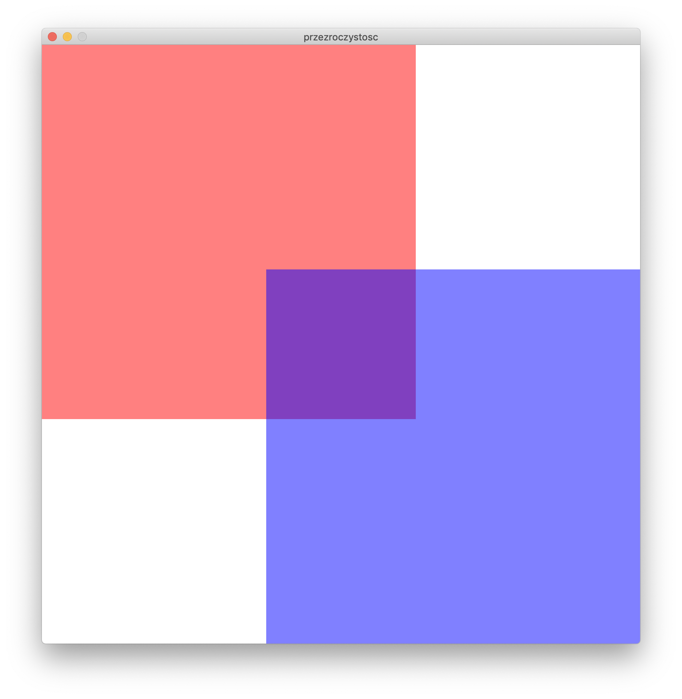
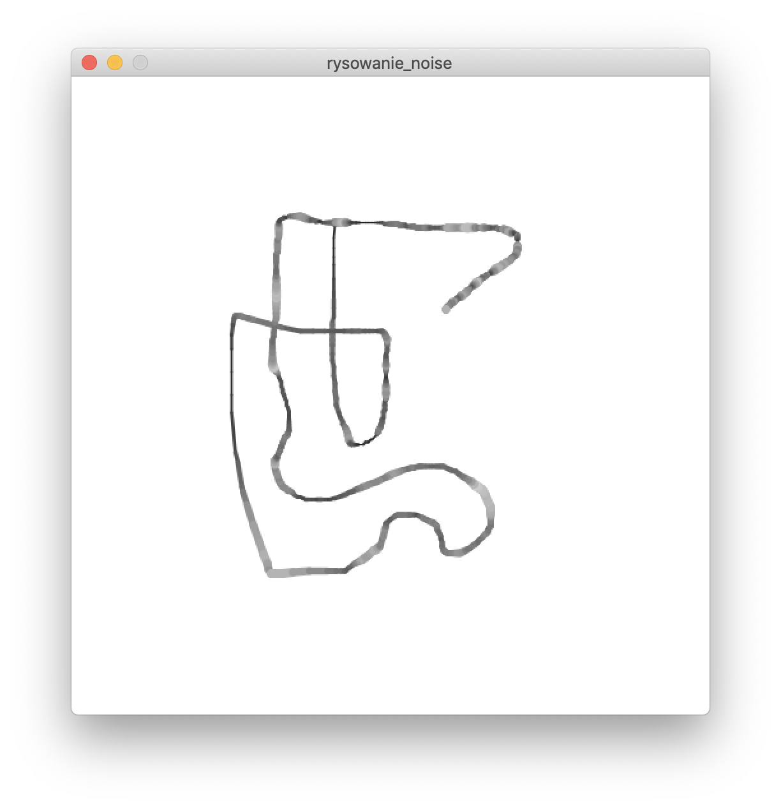

# Sezon 02 - Podstawy

## Processing
- background(), fill() i stroke()
- przezroczystość
- setup() i draw()
- mousePressed() i keyPressed()
- zmienne
- typy: float, int i void
- round(), floor(), ceil()
- lerpColor()
- saveFrame()
- random()
- noise()
- println()
- komentarze

## Zadanie domowe
Powtórzyć wszystkie instrukcje

## Materiały pomocnicze
- [Dokumentacja Processing](https://processing.org/reference)

## Ekrany

### przezroczystość RGBA - fill(R, G, B, A)

### rysowanie mouseX, mouseY, pmouseX, pmouseY

### szum = noise(frameCount/10.0)

