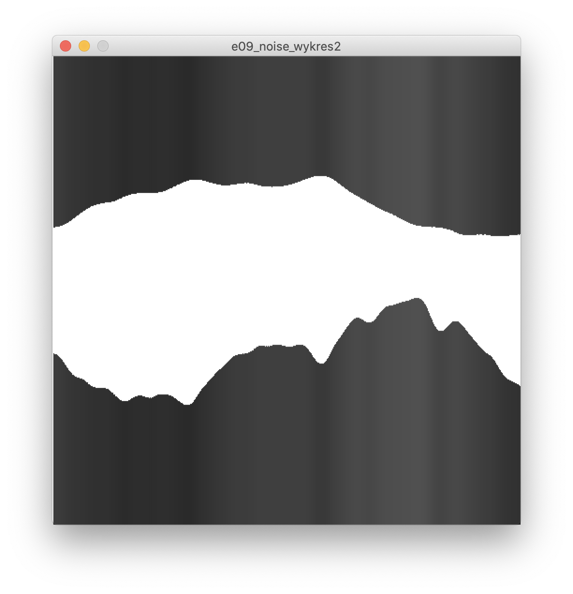
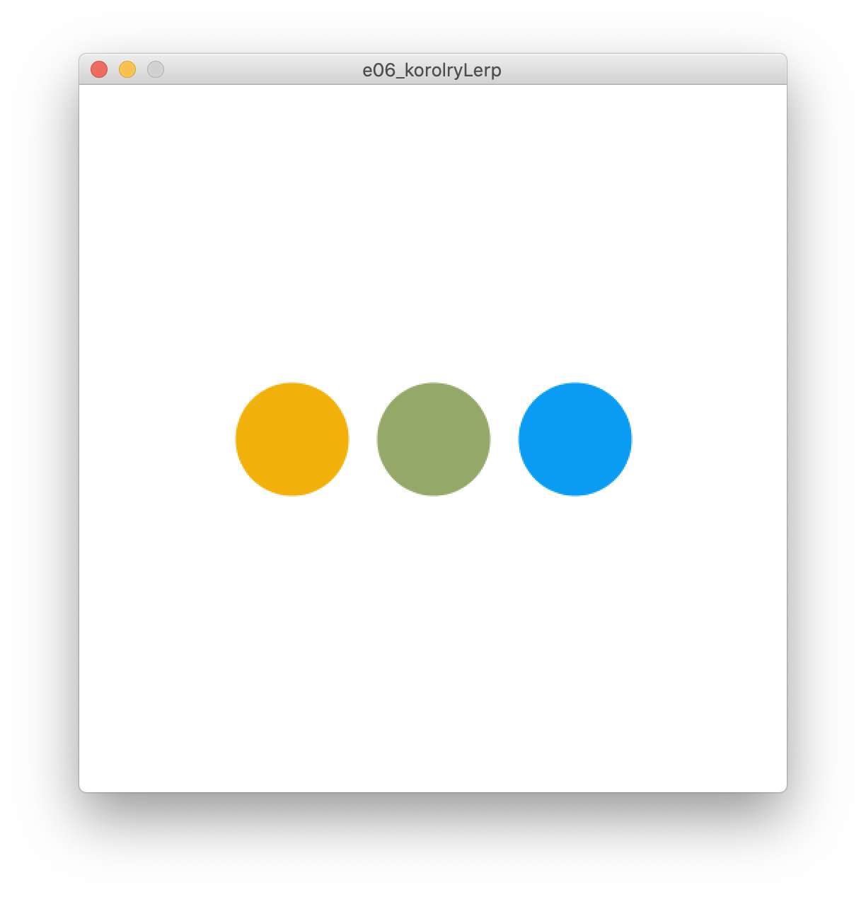
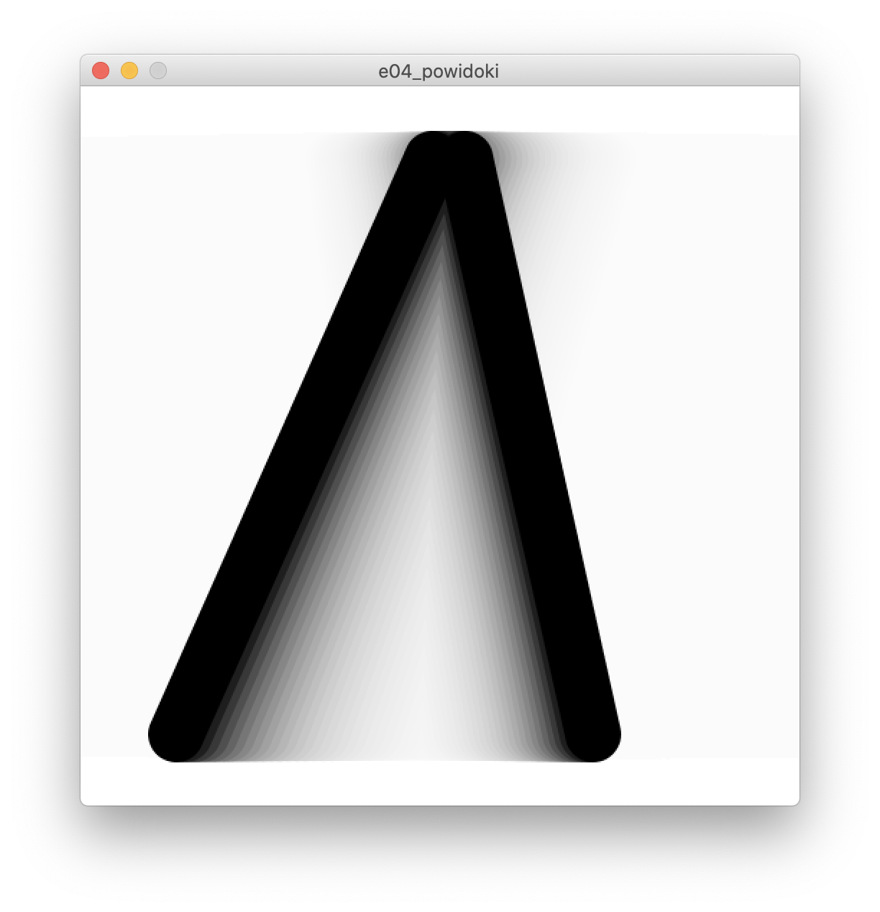
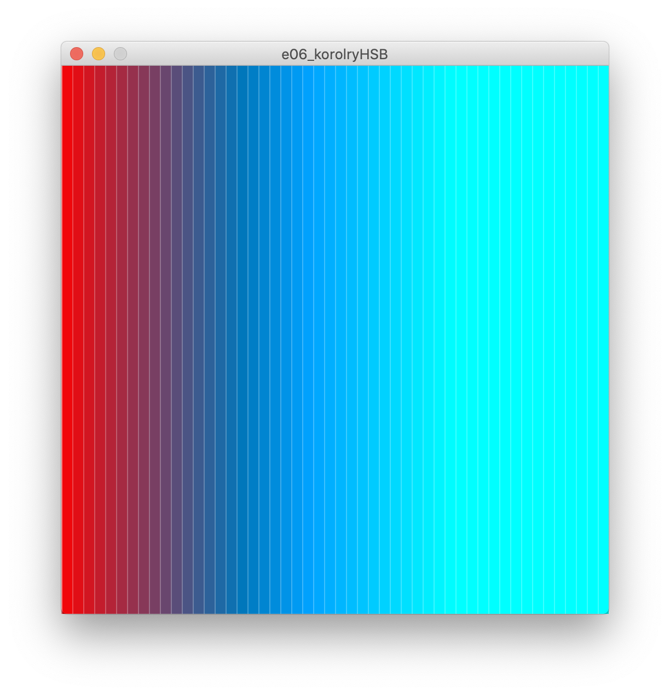

# Sezon 02 - animacja, zmienne oraz szum

## Processing
- Co zrobić żeby mieć ruchomy obraz

```Processing
void setup() 
{
  //tu piszemy co ma być raz na starcie programu
}
void draw() 
{
  //tu co ma się powtarzać z prędkością frameRate
}
```
- Reakcja na wciskanie klawiszy

```Processing
void keyPressed() {
  //tu co ma się stać kiedy naciśniemy dowolny klawisz 
}
```
- zmienne, czyli jak tworzyć pudełka do przechowywania zmieniających się wartości na przykładzie przechowywania koloru i liczb. 

```Processing
float waga = 15.3; 
waga = waga + 1.5; //zwiększenie wagi o jeden i pół.
color malinowy = color(202, 122, 30);
```
### zmienne wbudowane w procesing:
 - `frameCount` to zmienna licznik klatek, po każdej klatce animacji zwiększa się o jeden.
- `mouseX` to aktualna pozycja kursora myszy w poziomie.
 
### typy: 
- `float` 
- `void` 
- `color`

### problem zaokrąglania
- `400/500` to nie to samo co `400/500.0` 

### instrukcje: 
- `colorMode(HSB);` zmienia tryb kolorów na Hue, Saturation, Brightness
- `colorMode(HSB, 100);` taj powyżej i jeszcze zmienia zakres wartości składowych koloru z domyślnego 0-255 na 0-100.
- `lerpColor()` płynne przejście pomiędzy kolorami
- `saveFrame()` zapisuje na dysku aktualną klatkę anikacji
- `random()` pseudo losowość :) chaos rządzi. 
- `noise()` losowość jak w naturze.
- `println()` wydruk tego co podamy w nawiasie do konsoli (czarne okno na dole) 
- komentarz jednej linii 

```Processing
// komentuje jedną linię
// background(255) - albo do wyłączania instrukcji
```

## Zadanie domowe

Powtórzyć wszystkie instrukcje

## Materiały pomocnicze

- [Dokumentacja Processing](https://processing.org/reference)

## Ekrany

Noise w dwóch skalach, na górze to samo podwójnie rozciągnięte 



lerpColor płynnie przechodzi pomiędzy lewym i prawym kolorem



Przypadkowy efekt z liniami w ruchu


Powidoki przez zamalowywanie półprzezroczystym kwadratem



Kolory w HSB, kawałek spektrum hue.



