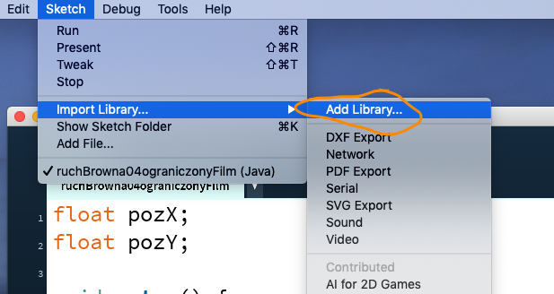

# Sezon 03 
- Powtórka `draw()` i `setup()`
- Zmienne raz jeszcze
- Typ zmiennych `float`
- Warunkowe wykonywanie instrukcji

```Processing
if(mouseX > 250) strokeWeight(30); //zmienia grubość obrysu 
                                   //na 30, jeżeli pozycja myszy
                                   //w poziomie przekroczy 250
```
  
- `colorMode(HSB);` zmienia tryb kolorów na Hue, Saturation, Brightness 
- Komentowanie / odkomentowanie grupy wierszy **Ctrl-/**
- `frameCount` to zmienna licznik klatek, po każdej klatce animacji zwiększa się o jeden.
- Dodawanie nowej biblioteki. Sposób na rozszerzanie możliwość Processing przez wprowadzanie nowych instrukcji, typów, obiektów itp.



Wybranie biblioteki do dodania np. Video Export


- Dodawanie nowych narzędzi np. Rozszerzonego uzupełniania składni


Wybranie narzędzia do dodania


- Ustawienie automatycznego uzupełniania kodu **Processing > Preferences…**


## Zadanie domowe
Rysowanie przez odbijanie. Zmodyfikujcie przykład odbijaczXYwzor

## Materiały pomocnicze
- Interactivity
https://processing.org/tutorials/interactivity/
- Coordinate System and Shapes
https://processing.org/tutorials/drawing/
- Variables
https://youtu.be/B-ycSR3ntik

