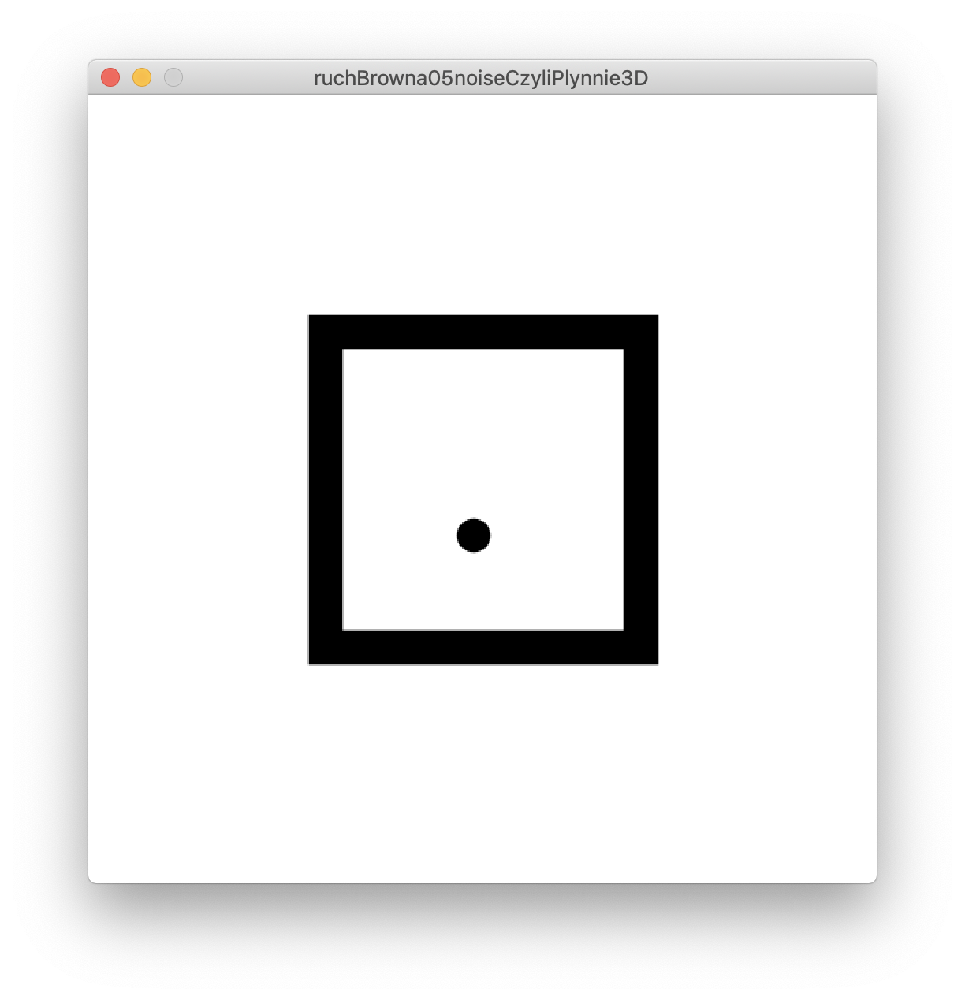
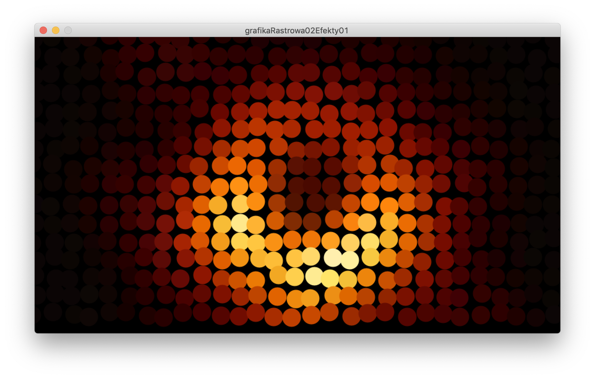
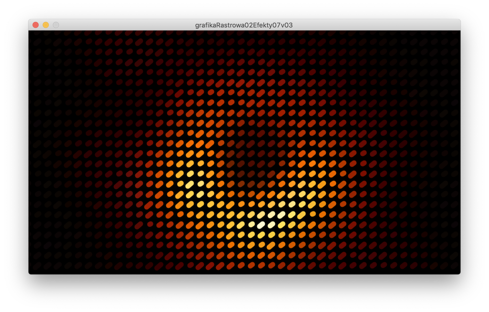
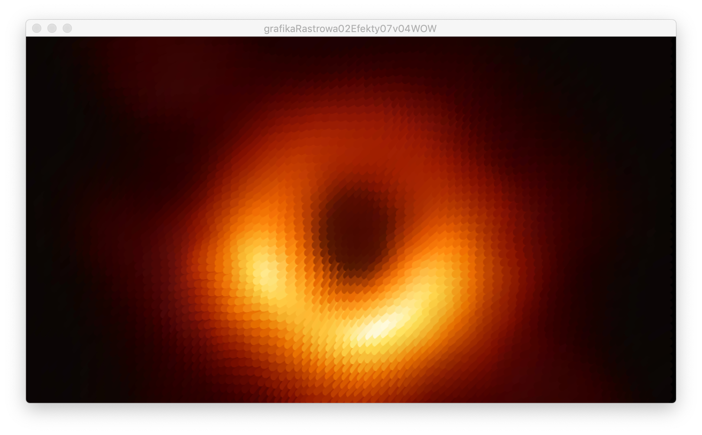

# Sezon 04 
- `fullScreen();` bez okna na całym ekranie
- `width`, `height` wymiary okna lub ekranu
- Losowość powtórka
- `saveFrame()` powtórka
- **Tools > Movie Maker** tworzenie wideo z klatek animacji
- Typy zmiennych `int`, `PImage`
- Wykonanie warunkowe powtórka `if`
- Pętla, czyli powtarzanie określoną liczbę razy

```Processing
for(int i = 0; i < 10; i++) point(i*30, 250); 
//rysuje 10 punktów w poziomie na wysokości 250 w odstępach 30
```

- Pętla w pętli (fachowo *zagnieżdżanie pętli*), czyli np. grafika w dwóch wymiarach

```Processing
for(int i = 0; i < width; i+=20) 
	for(int j = 0; j < height; i+=40) 
		point(i, j);
//rysuje punkty na całym ekranie
//w odstępach 20 w poziomie i 40 w pionie
```

- Noise powtórka 
- Ruch browna 
- `loadImage();` ładowanie plikiu graficznego do zmiennej typu `PImage`
- `“czarna dziura.jpg”` to jest `String` czyli dowolny ciąg znaków np. nazwa pliku
- `image()` rysowanie grafiki
- PImage to obiekt, można z nim rozmawiać przez kropkę np. `dziura.width` pyta obraz czarnej dziury jaką ma szerokość
- `get(,);` pobieranie koloru konkretnego piksela
- `settings()` czyli jak ustawić rozmiary okna na postawie zmiennych
- `map(,,,);` mapowanie zakresu wartości na inny zakres wartości
- `constrain(,,);` ograniczanie wartości do zakresu

## Zadanie domowe
Proszę zrobić kod przetwarzający obraz z pliku png, jpg lub tiff.  

## Materiały pomocnicze
- Images and Pixels
https://processing.org/tutorials/pixels/
- Noise i ruch browna
http://natureofcode.com/book/introduction/
https://vimeo.com/58492076

## Ekrany 

Ruch generowany przez `noise()` zamknięty w kwadracie



Nakładanie efektu na grafikę `for(){for()}` `random(,)`  `point(,)`



Nakładanie efektu na grafikę `for(){for()}` `random(,)`  `line(,,,)`



Nakładanie efektu na grafikę `for(){for()}` `noise(,)` 2d

