# Sezon 05 - tablice i sortowanie pikseli

## Processing
- `hue()`, `saturation()`, `brightness()` rozkładanie koloru na składowe HSB
- `red()`, `blue()`, `green()` rozkładanie koloru na składowe RGB
- `pixels[]` tablica pikseli w grafice rastrowej
- `loadPixels()` ładowanie tablicy z grafiki
- `updatePixdls()` aktualizowanie grafik na podstawie tablicy
- Zamiana miejscami kolorów dwóch pikseli np. dwóch sąsiednich pikseli. 

```Processing
color c = pixels[i];
pixels[i] = pixels[i-1];
pixels[i-1] = c;  
```

- `int()` - czyli zamiana na liczbę całkowitą np. `3.7` zamieni na `3`.
- Sortowanie pikseli, czyli układanie pikseli w obrazie w innej kolejności niż oryginalna.

```Processing
  peppa.loadPixels();
  for (int i = 1; i < peppa.pixels.length; i++) {
    color c = peppa.pixels[i];
    peppa.pixels[i] = peppa.pixels[i-1];
    peppa.pixels[i-1] = c;
  }
  peppa.updatePixels();
```

- Tablice, dzięki nim możemy przechowywać w jednej zmiennej więcej niż jeden element np. wiele liczb, kolorów itd.

```Processing
int[] liczby = {23, 11, 4, 7, 2, 8} 
//tablica zawierające liczy całkowite, 
//23 na pozycji 0,
//11 na pozycji 1 itd. 
//aż do 8 na pozycji 5. 
//W sumie 6 liczb.
```

- `.length` tak pytamy o liczbę elementów w tablicy, albo inaczej mówiąc długość tablicy.
- `x = muchy[3]` - pobieranie elementu z tablicy, tu w `x` umieszczam wartość z `3` pozycji w tablicy `muchy`

## Zadanie domowe
Stwórzcie własny efekt wizualny sortując pixele. Udanego sortowania!

## Materiały pomocnicze
- [Pixel Sorting](http://satyarth.me/articles/pixel-sorting/)
- [Images and Pixels](https://processing.org/tutorials/pixels/)
- [Bubble sort](https://en.wikipedia.org/wiki/Bubble_sort)
- [Sorting Algorithms Animations](https://www.toptal.com/developers/sorting-algorithms)

## Ekrany 

Ruch wielu much połączonych liniami. Pozycje much w tablicy.

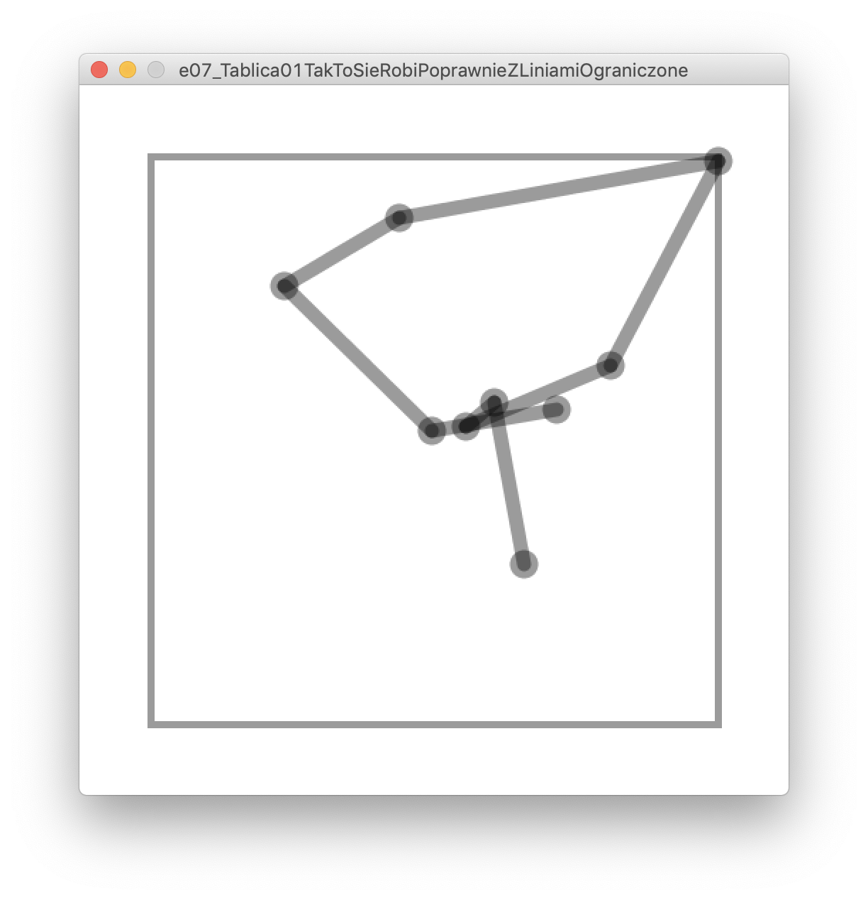

Ruch bardzo wielu much połączonych liniami. Na pełnym ekranie. Pozycje much w tablicy.

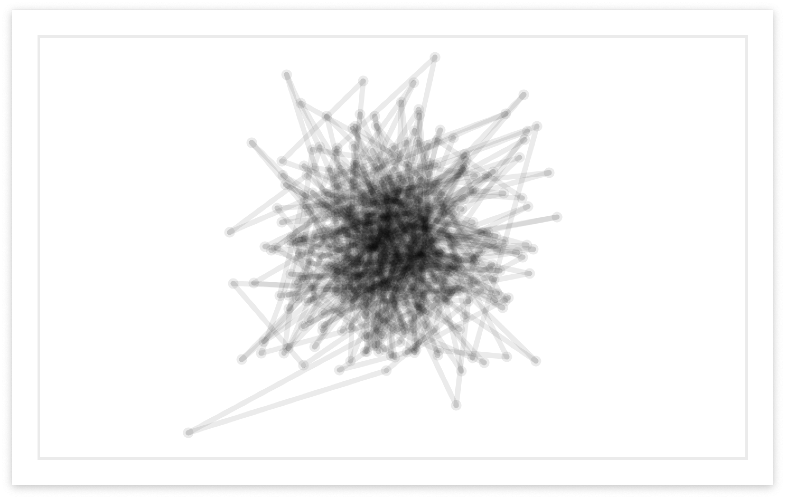

Ruch much na obrazie z pliku

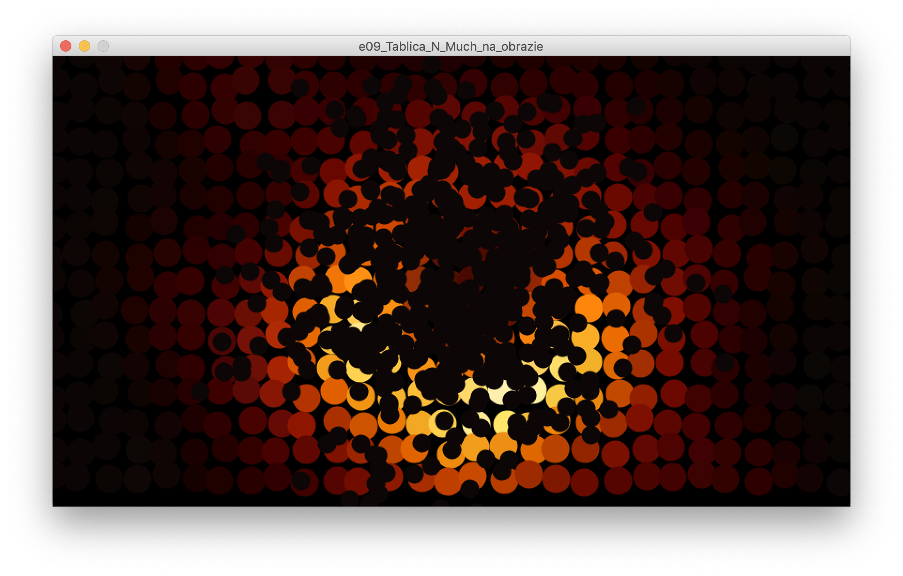

Ruch much z pozycjami startowymi w siatce z kolorami pobranymi z obrazu z pliku.

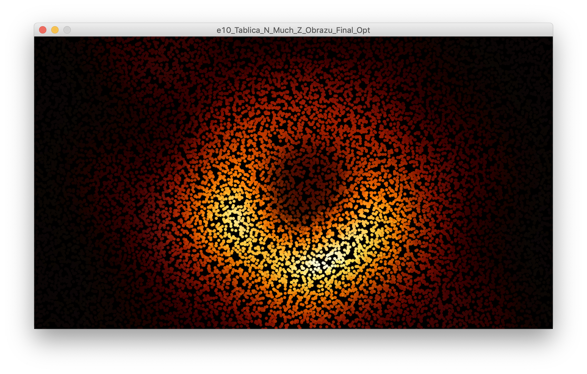

Sortowanie pikseli - średnia sąsiednich kolorów. 

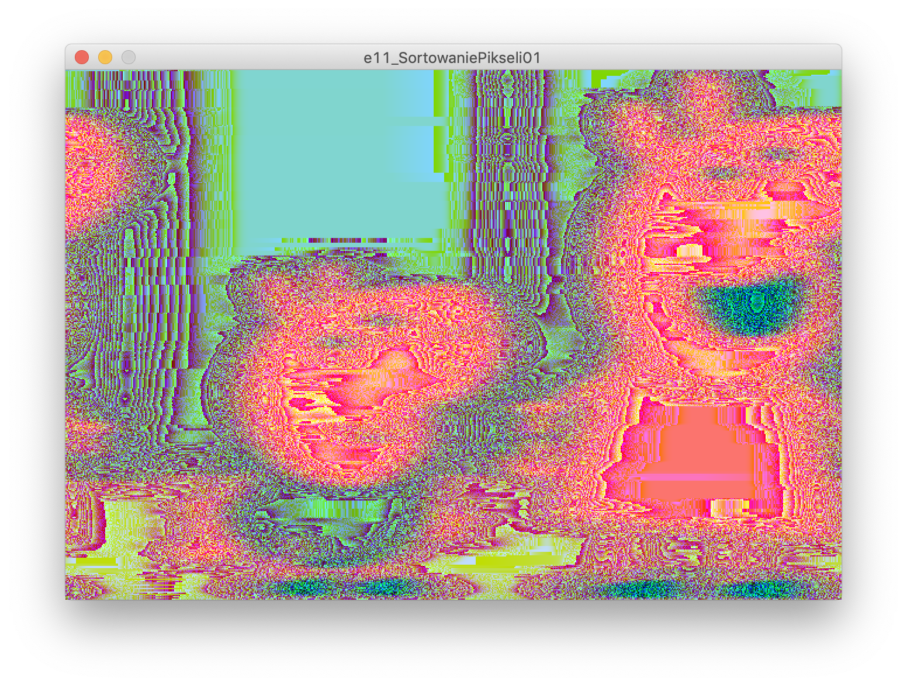

Sortowanie pikseli - zamiana sąsiednich pikseli na podstawie progowej wartości barwy (hue) 

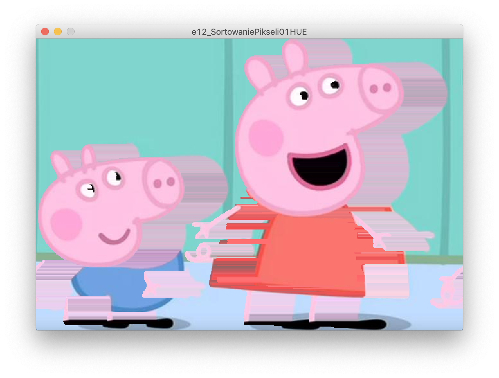

Sortowanie pikseli - mniejszy kolor z dwóch końców tablicy 

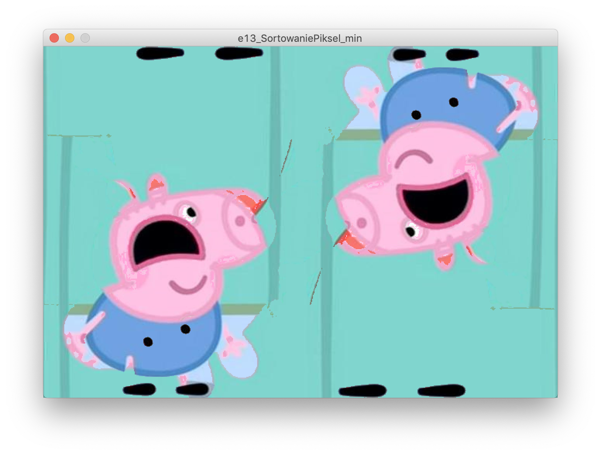

Sortowanie pikseli - większy kolor z dwóch końców tablicy 

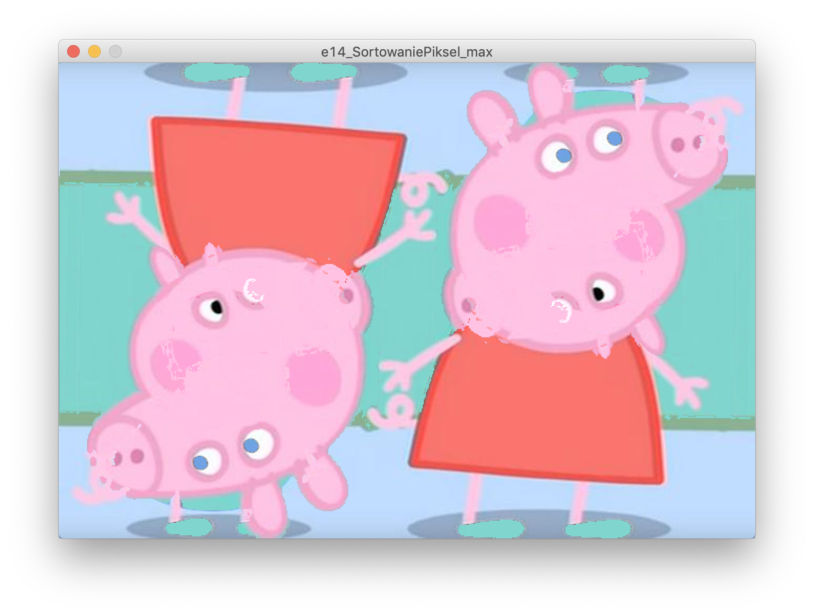

Sortowanie pikseli - zamiana miejscami (swap) sąsiednich pikseli 

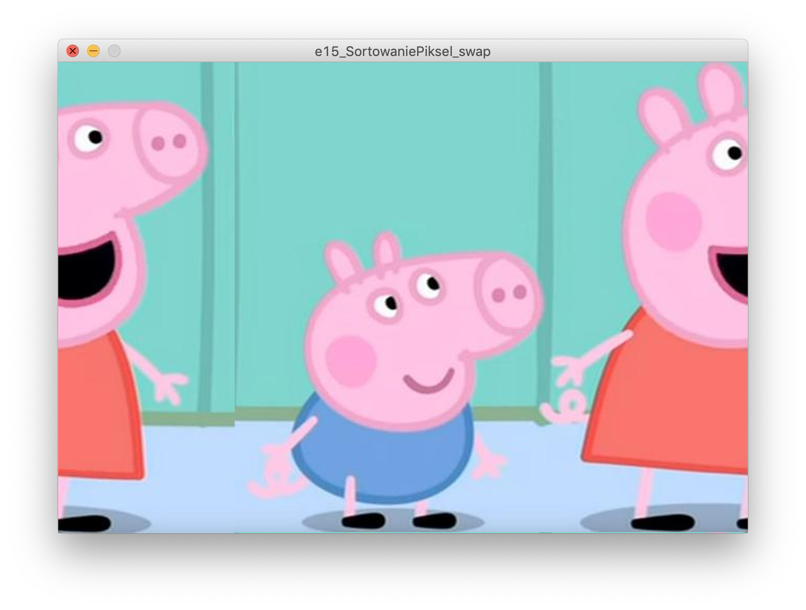

Sortowanie pikseli - zamiana miejscami (swap) pikseli w losowym odstępie   

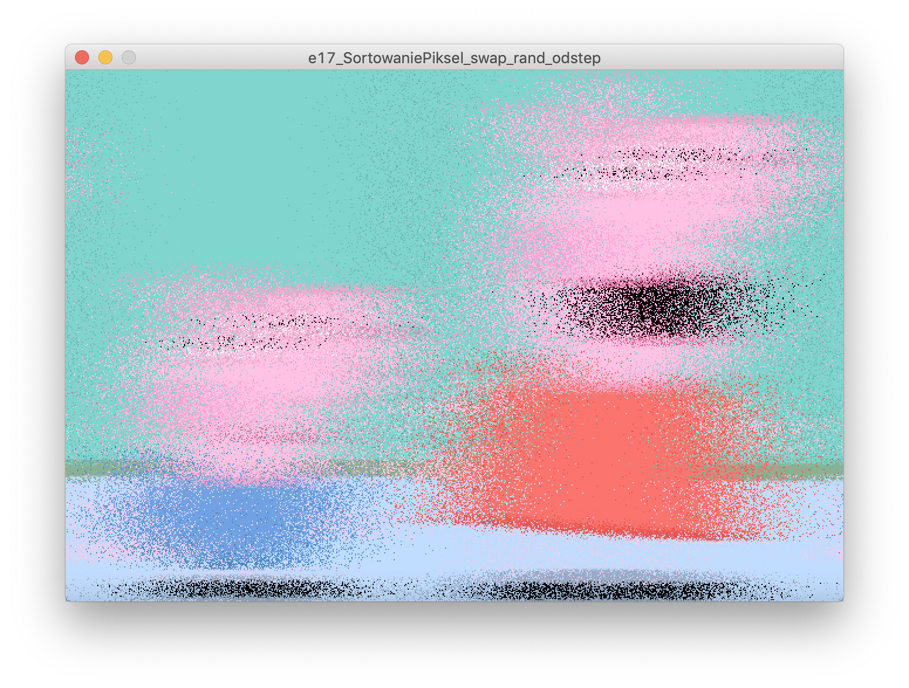

Sortowanie pikseli - zamiana miejscami (swap) pikseli z dwóch końców tablicy na podstawie porównania ich barwy

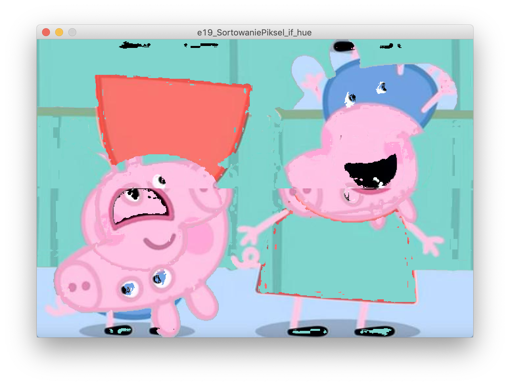


