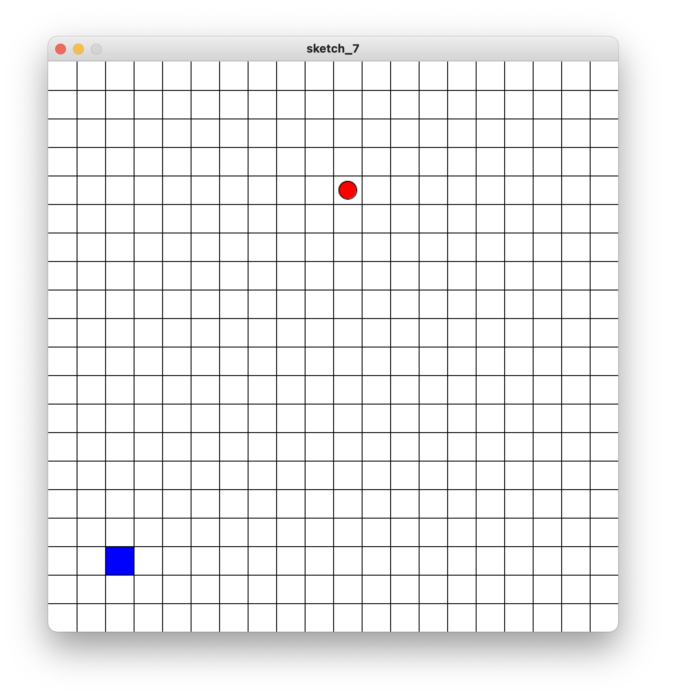
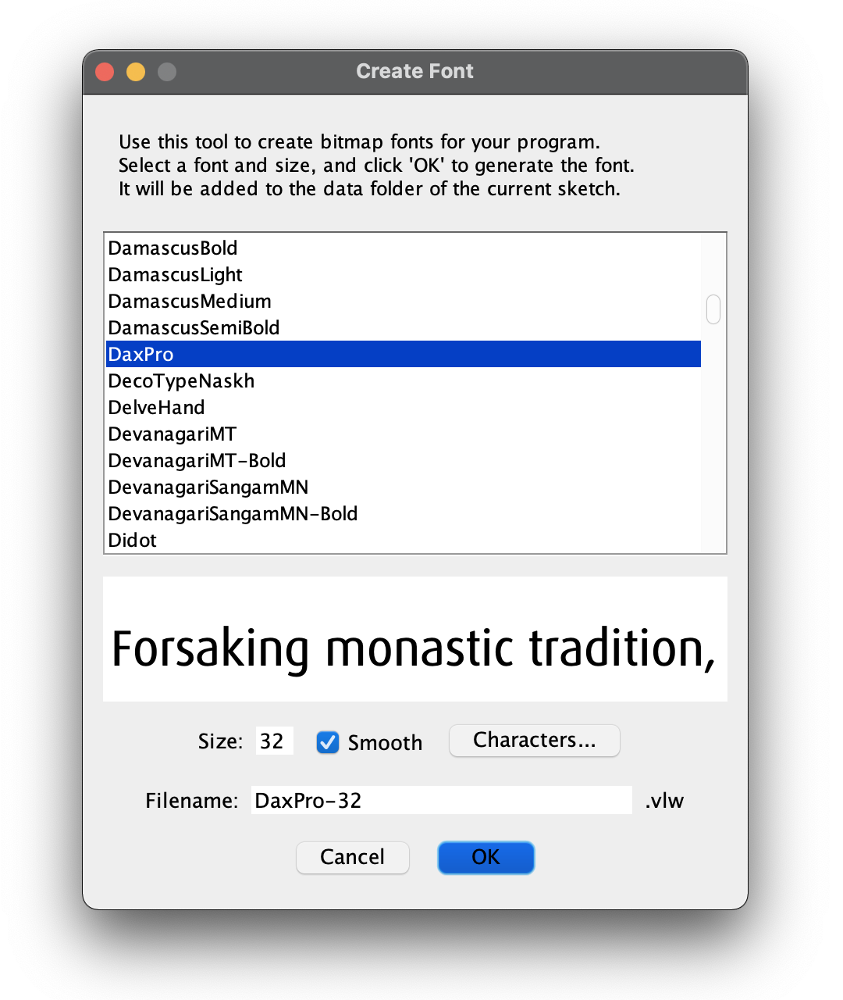

# Sezon 06 - analiza ruchu oparta na zdarzeniach

W ramach zajęć stworzyliśmy prosty mechanizm, w którym poruszający się obiekt (punkt) wchodzi w interakcję z innym obiektem obecnym w dostępnej przestrzeni.

Punkt porusza się autonomicznie, ale możemy wpływać na jego położenie za pomocą zdarzeń wywoływanych z użyciem klawiatury.
W momencie interakcji punktu z obiektem, następuje ustawienie nowego obiektu w innym miejscu.

Tego typu mechanizm może zostać użyty np. do tworzenia własnych interaktywnych instalacji w fizycznej przestrzeni.



## Poruszone zagadnienia:

- obsługa zdarzeń klawiatury
- generowanie losowych liczb w wybranym zakresie 
- animacja oparta na odstępach czasu
- analiza kolorystyczna (pomiar barwy)
- wyświetlanie tekstu
- wcześniejsze zagadnienia, np. funkcje, zmienne globalne, animacja

### Obsługa zdarzeń klawiatury

- `key` - zmiennej zawiera wartość ostatnio użytego (naciśniętego) klawisza na klawiaturze.
- `keyCode` - zmienna `keyCode` służy do wykrywania klawiszy specjalnych, takich jak strzałka  `↑ UP (w górę)`, `↓ DOWN (w dół)`, `← LEFT (w lewo)`, `→ RIGHT (w prawo)` oraz `ALT`, `CONTROL`, `SHIFT`.
- `keyPressed` - funkcja jest wywoływana po naciśnięciu klawisza. Naciśnięty klawisz jest przechowywany w zmiennej `key`.
 
```Processing
void keyPressed() {
    // logika działania po użyciu klawiatury 
}
```

W przypadku używania strzałek, sprawdzanie odbywa się za pomocą warunku, np. `if (keyCode == LEFT)`

```Processing
void keyPressed() {
    if (keyCode == LEFT) {
        // działania po naciśnięciu strzałki w lewo
    }
}
```

W przypadku używania standardowych klawiszy, sprawdzanie odbywa się za pomocą warunku, np. `if (keyCode == 'a')`.

**UWAGA**: istotna jest wielkość danego znaku, to znaczy że `a` nie zadziała, gdy mamy włączone duże litery, czyli `A`. 

```Processing
void keyPressed() {
    if (key == 'a' || key == 'A') {
        // działanie po naciśnięciu przycisku 'A' (dużego lub małego)
    }
}
```

### Generowanie losowych liczb w wybranym zakresie

Za każdym razem, gdy funkcja `random()` zostanie wywoływana, zwracana jest losowa wartość z określonego zakresu.
Na przykład `random(5)` zwraca wartości z zakresu od 0 do 5 (od zera do 5, ale nie wliczając 5).

**UWAGA**: zwracana wartość jest liczbą zmiennoprzecinkową reprezentują liczbę rzeczywistą. Gdy chcemy uzyskać liczbę całkowitą należy zmienić jej typ z `float` na `int`.  

```Processing
float r = random(50);

// wylosowana została wartość np. 0.3342107

println(r); // 0.3342107

println( int(r) ); // 0
```

Jeśli podamy dwa parametry, funkcja `random()` zwróci liczbę losową z wartością między tymi dwiema wartościami. Na przykład random(-5, 5) zwraca wartości zaczynające się od -5 do 5 (ale nie włączając 5).

```Processing
float r = random(-5, 5);

// wylosowana została wartość np. -2.5643568

println(r); // -2.5643568

println( int(r) ); // -2
```

### Animacja oparta na odstępach czasu

- `frameCount` - zmienna `frameCount` zawiera liczbę klatek wyświetlonych od momentu uruchomiania programu. Na starcie programu, wartość ta wynosi 0, a po pierwszej iteracji losowania wynosi 1, itd.
- `frameRate()` - określa liczbę klatek wyświetlanych co sekundę. Na przykład, wywołanie funkcji `frameRate(30)` będzie próbowało odświeżyć się 30 razy na sekundę.

Gdy chcemy, aby jakieś zdarzenie wystąpiło co określony odstęp czasu (interwał), używamy sprawdzenia aktualnej klatki animacji `frameCount` podzielonej przez ustawioną liczbę klatek na sekundę, czyli `frameRate()`. Dokonując wyznaczania reszty z dzielenia (modulo), sprawdzamy kiedy otrzymana wartość będzie bez reszty (czyli wyniesie 0).

> **Przykład**:
> - `29 % 30` => `29` reszty - dzielenie z resztą.
> - `30 % 30` => `0` reszty - dzielenie *BEZ reszty*.
> - `31 % 30` =? `1` reszty - dzielenie z resztą.

Zdarzenie, które wykona się 1 raz na sekundę:

```Processing
int interwal = 30;

void setup() {
    frameRate(30);
}

void draw() {
    if (frameCount % interwal == 0) {
        // wykonaj akcję 1 raz na sekundę
    }
}
```

Zdarzenie, które wykona się do 5 raz na sekundę:

```Processing
int interwal = 6;

void setup() {
    frameRate(30);
}

void draw() {
    if (frameCount % interwal == 0) {
        // wykonaj akcję co 1/5 sekundy (6/30)
    }
}
```

Zdarzenie, które wykona się co 2 sekundy:

```Processing
int interwal = 60;

void setup() {
    frameRate(30);
}

void draw() {
    if (frameCount % interwal == 0) {
        // wykonaj akcję co 2 sekundy
    }
}
```

### Analiza kolorystyczna (pomiar barwy)

- `color` - typ danych, który służy do przechowywania wartości kolorów. Kolory można przypisać za pomocą `get()` i `color()` lub można je określić bezpośrednio za pomocą notacji szesnastkowej, takiej jak `#FF0000` lub `0xFFFF0000`. 
- `color()` - funkcja służąca do tworzenia kolorów. Parametrami są wartości od 0 do 255. 
- `get()` - użyć funkcji `get(x, y)` pozwala sprawdzić, jaki kolor ma konkretny piksel na ekranie (lub na obrazie). Parametry `x` i `y` określają współrzędne licząc od lewego górnego rogu ekranu.

```Processing
color niebieski = color(0, 0, 255);
color czerwony = color(255, 0, 0);

fill(czerwony); 
rect(0, 0, width, height/2);

fill(niebieski);
rect(0, height/2, width, height/2);

color kolorA = get( width/2, 25); // góra część ekranu
color kolorB = get( width/2, 75); // dolna część ekranu

println(kolorA == niebieski); // false
println(kolorB == niebieski); // true
```

### Wyświetlanie tekstu

`text()` - funkcja, która rysuje tekst na ekranie. Wyświetla informacje określone w pierwszym parametrze. Pozycja tekstu jest określana przez dodatkowe parametry.

```Processing
fill(255, 0, 0); // ustaw kolor tekstu
text("Hi!", 20, 20);
```

Aby użyć własny font, należy go utworzyć za pomocą narzędzia wbudowanego w Processing.
Z menu wybieramy `Tools`, a następnie `Create Font...`.
Wskazujemy font, który chcemy użyć, następnie określamy rozmiar docelowy (`Size`) oraz nazwę pliku (`Filename`), który zostanie dodany do katalogu projektu.



Tak utworzony font (np. `DaxPro-32.vlw`) musimy załadować za pomocą `loadFont()` oraz ustawić ten font, aby móc za jego pomocą rysować używając `text()`.

```Processing
fill(0);

// By pomyślnie załadować font, musi się on znajdować 
// w katalogu "data" w ramach projektu

PFont font = loadFont("DaxPro-32.vlw");

textFont(font, 32);
text("Hi!", 30, 60);
```

### Zadanie domowe

Proszę tak zmodyfikować stworzony mechanizm, aby umożliwić interakcję z dwoma różnymi obiektami (oba obiekty muszą być widoczne w tym samym czasie). 
Niech dodatkowy obiekt ma inną reprezentację (np. inny kolor, kształt) i jest umieszczany w środkowej części ekranu.

Zadanie dla chętnych (dodatkowe) to dodanie mechanizmu, gdzie w miarę upływu czasu punkt zaczyna się poruszać coraz szybciej. 


### Typy danych wbudowane w Processing:

- `boolean` - typ danych dla wartości logicznych prawda (`true`) i fałsz (`false`).
- `color` - typ danych, który służy do przechowywania wartości kolorów. Kolory można przypisać za pomocą `get()` i `color()` lub można je określić bezpośrednio za pomocą notacji szesnastkowej, takiej jak `#FF0000` lub `0xFFFF0000`.
- `float` - typ danych dla liczb zmiennoprzecinkowych, np. liczby z kropką dziesiętną (0.3342107).
- `int` - typ danych dla liczb całkowitych, liczb bez kropki dziesiętnej (3342107).

### Zmienne wbudowane w Processing:

- `frameCount` - zmienna `frameCount` zawiera liczbę klatek wyświetlonych od momentu uruchomienia programu.
- `key` - zmiennej zawiera wartość ostatnio użytego (naciśniętego) klawisza na klawiaturze.
- `keyCode` - zmienna `keyCode` służy do wykrywania klawiszy specjalnych, takich jak strzałka  `↑ UP (w górę)`, `↓ DOWN (w dół)`, `← LEFT (w lewo)`, `→ RIGHT (w prawo)` oraz `ALT`, `CONTROL`, `SHIFT`.

### Instrukcje (funkcje) wbudowane w Processing:

- `color()` - funkcja służąca do tworzenia kolorów. Parametrami są wartości od 0 do 255.
- `frameRate()` - określa liczbę klatek wyświetlanych co sekundę. Na przykład, wywołanie funkcji `frameRate(30)` będzie próbowało odświeżyć się 30 razy na sekundę.
- `get()` - użyć funkcji `get(x, y)` pozwala sprawdzić, jaki kolor ma konkretny piksel na ekranie (lub na obrazie). Parametry `x` i `y` określają współrzędne licząc od lewego górnego rogu ekranu.
- `keyPressed()` - funkcja jest wywoływana po naciśnięciu klawisza. Naciśnięty klawisz jest przechowywany w zmiennej `key`.


## Materiały pomocnicze

- [Obsługa klawiatury](https://processing.org/reference#input-keyboard)
- [Użycie koloru](https://processing.org/reference/color_datatype.html)
- [Użycie tekstu](https://processing.org/reference/text_.html)


