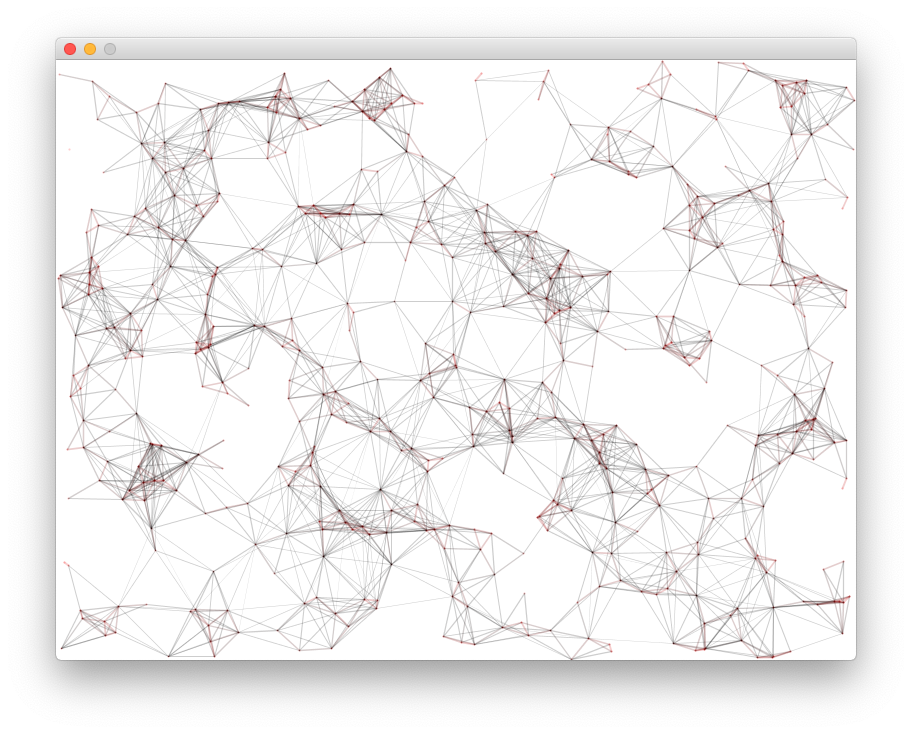

# Sezon 06 - Grafika wektorowa

## Processing

- `PShape` typ zmiennej do przechowywania grafiki wektorowej
- `loadShape()` ładowanie grafiki z pliku
- `shape()` rysowanie grafiki wektorowej
- `disableStyle()`
- `shapeMode()`

- `radians()` konwersja kąta w stopniach na radiany (360°->TWO_PI)

## Materiały pomocnicze

- [PShape](https://processing.org/tutorials/pshape)
- [Krzywe](https://processing.org/tutorials/curves)
- [Export PDF](https://processing.org/reference/libraries/pdf/index.html)

## Ekrany

Efekt końcowy 

## Zadanie domowe

Spróbować wygenerować którąś z kompozycji Wall Drawings opisanych przez Sol'a LeWitt'a (plik instructions.json z repozytorium [Solving Sol](https://github.com/wholepixel/solving-sol))