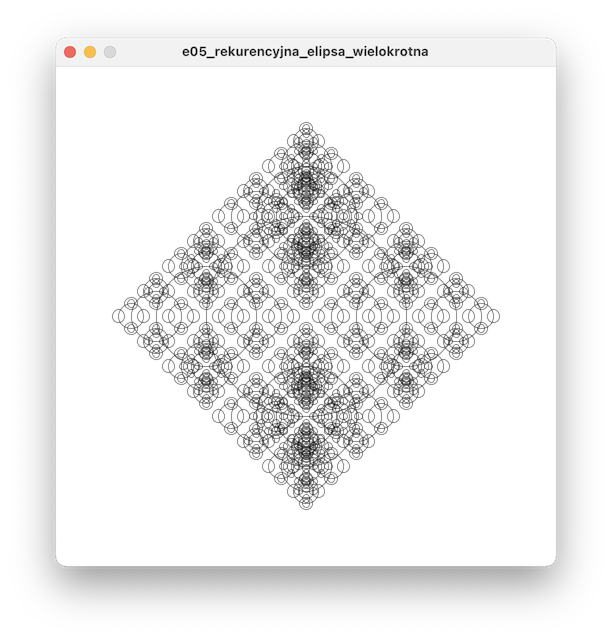
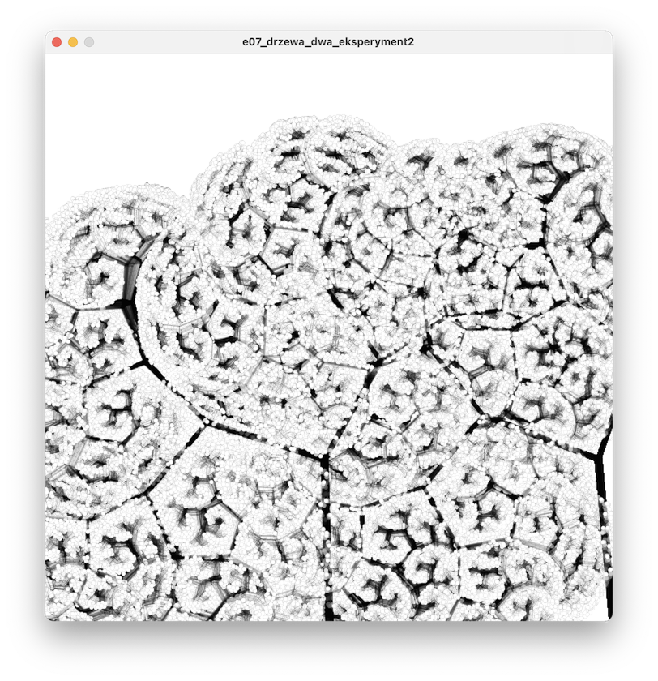
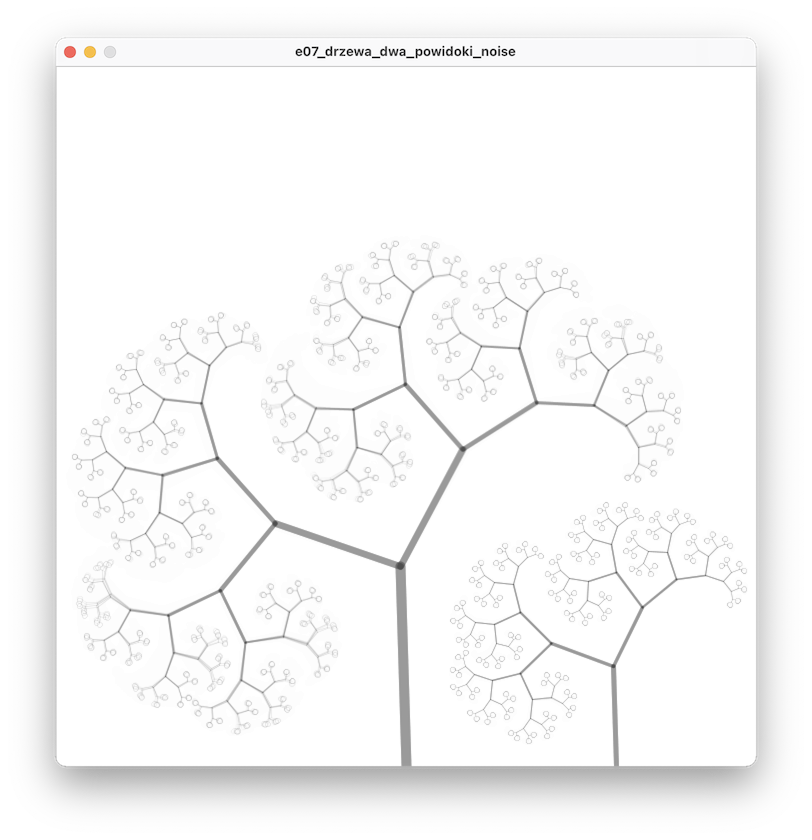
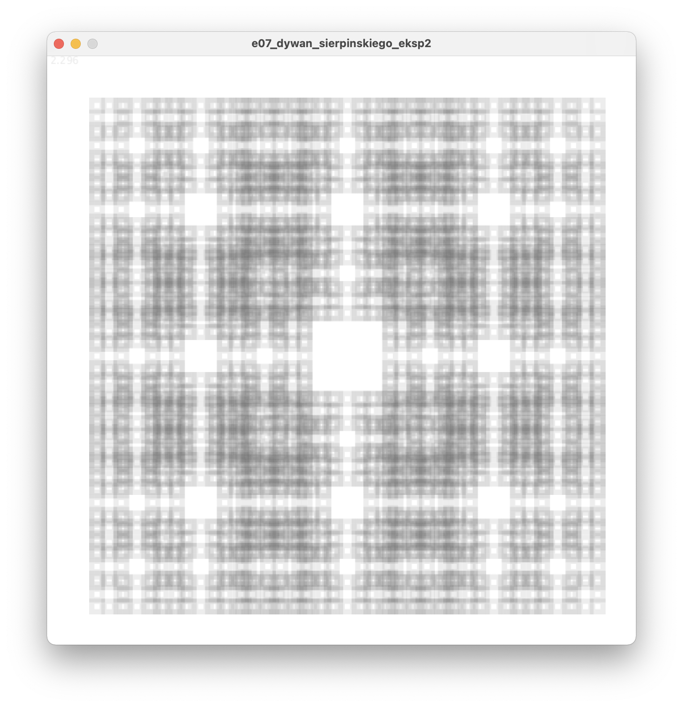
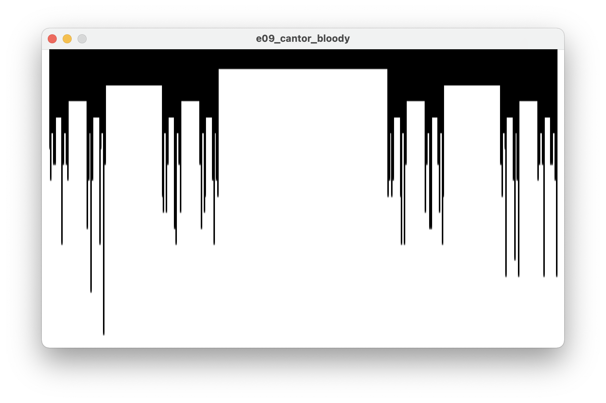

# Sezon 07 - Rekurencja i fraktale

## Processing

- [Rekurencja](https://pl.wikipedia.org/wiki/Rekurencja) - czyli funkcja wywołująca samą siebie. Pamiętajmy o instrukcji warunkowej wewnątrz takiej funkcji, która zapobiega nieskończonemu wywoływaniu, co nieuchronnie zawiesi program.

```Processing
void czymJestRekurencja()
{ 
  czymJestRekurencja(); //wywołuje siebie 
} 
```

- Fraktale - geometryczny obiekt charakteryzujący się [samopodobieństwem](https://pl.wikipedia.org/wiki/Samopodobieństwo) - czyli niezależnie od stopnia powiększenia powtarza się ten sam wzór, musi też mieć nietrywialną strukturę - bo np. zwykły odcinek jest samopodobny ale fraktalem nie jest.

## Zadanie domowe

Stworzyć własny fraktal albo modyfikację pokazanych na zajęciach.

## Materiały pomocnicze

- [Benoit Mandelbrot - twórca fraktali](https://en.wikipedia.org/wiki/Benoit_Mandelbrot)
- [Nature of Code - intro o fraktalach](https://www.youtube.com/watch?v=-wiverLQl1Q)
- [The Nature of Code Chapter 8. Fractals](https://natureofcode.com/book/chapter-8-fractals/)
- [8.1: Fractals - The Nature of Code video](https://www.youtube.com/watch?v=-wiverLQl1Q)
-  [8.2: Fractal Recursion - The Nature of Code video](https://youtu.be/s3Facu6ZVeA)
- [Fraktal wiki](https://en.wikipedia.org/wiki/Fractal)

**Fraktale - inspiracje:**

- [Dywan Sierpińskiego](http://www.mini.pw.edu.pl/MiNIwyklady/fraktale/Dywan/dywan.html)
- [Zbiór Cantora](https://pl.wikipedia.org/wiki/Zbiór_Cantora)
- [Koch Snowflake](http://mathworld.wolfram.com/KochSnowflake.html)
- [Trójkąt Sierpińskiego](http://www.mini.pw.edu.pl/MiNIwyklady/fraktale/Trojkat/trojkat.html)
- [Box Fractal](http://mathworld.wolfram.com/BoxFractal.html)
- [Koch Antisnowflake](http://mathworld.wolfram.com/KochAntisnowflake.html)
- [Cesàro Fractal](http://mathworld.wolfram.com/CesaroFractal.html)
- [Cross-Stitch Curve](http://mathworld.wolfram.com/Cross-StitchCurve.html)

**Książki:**

- [Granice chaosu: fraktale część 1, Heinz-Otto Peitgen , Dietmar Saupe , Hartmunt Jürgens](https://merlin.pl/granice-chaosu-fraktale-czesc-1-hartmunt-jrgens-heinz-otto-peitgen-dietmar-saupe/1327261/)
- [Granice chaosu. Fraktale - część 2](https://merlin.pl/granice-chaosu-fraktale-czesc-2-hartmut-jurgens-heinz-otto-peitgen-dietmar-saupe/1757950/)

## Ekrany

Rekurencyjne elipsy



Drzewa




Dywany



Cantor


