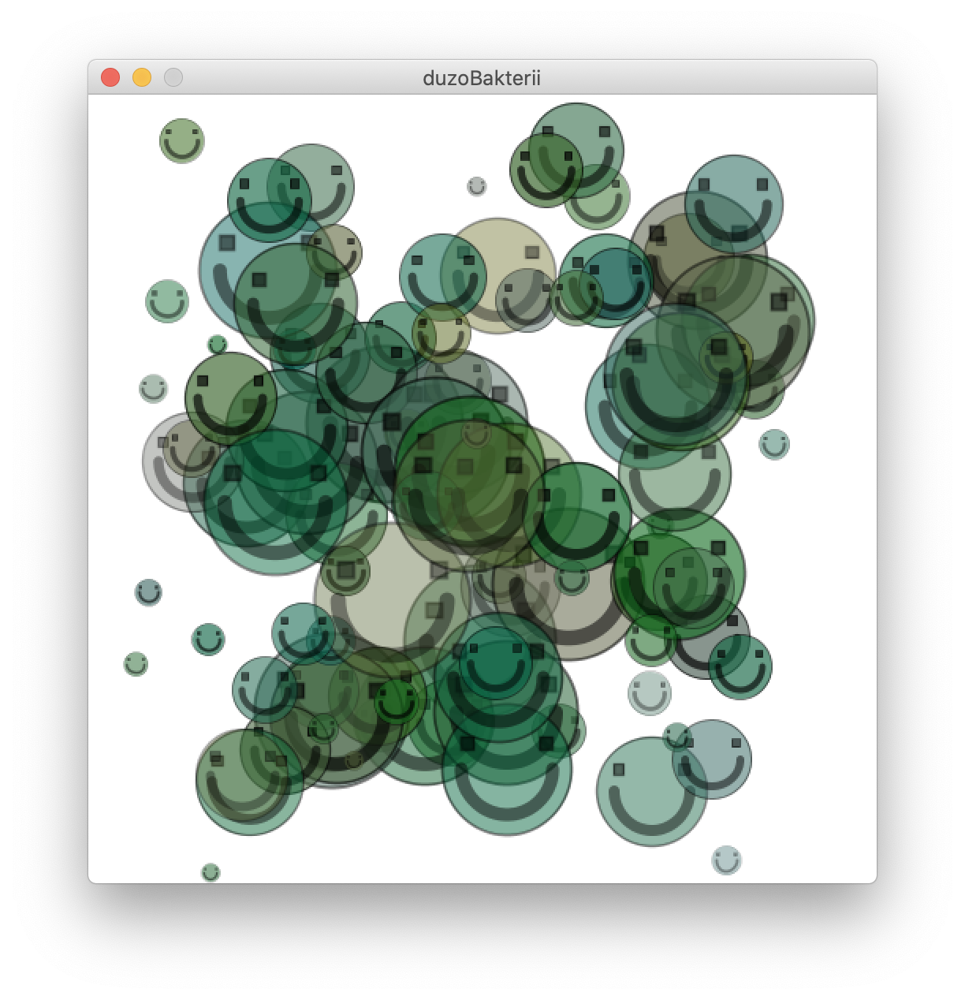
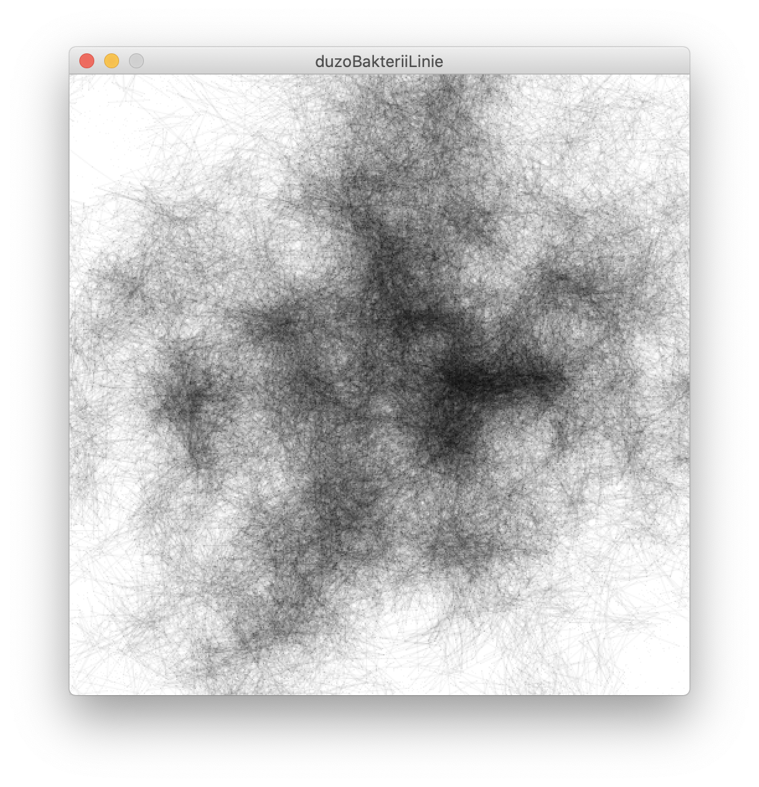

# Sezon 07 - funkcje i obiekty

## Processing

**Funkcje, czyli definiowanie własnych poleceń**
- `void` vs. `float`, `int`, `boolean`…, czyli co funkcja zwraca 
- `return` tu ustalamy co funkcja ma zwrócić
- parametry funkcji i określanie typów parametrów

**Klasy i obiekty, czyli tworzenie własnych światów w kodzie**
- Definiowanie klasy np.:
```Processing
class Bakteria { 
	//tu co składa się na klasę
  //atrybuty
  int wiek
  //metody
  void move() { … } 
  //konstruktor
  Bakteria () { … }
 }
```
- konstruktor tworzy obiekt klasy i może  robić inne rzeczy np. dodatkowo ustalić wartości atrybutów. 
- tworzenie własnych klas obiektów, jak powyżej `Bakteria`
- tworzenie obiektów danej klasy np.:
```Processing
Bakteria andrzej = new Bakteria();
```
- tablica obiektów np.:
```Processing
Bakteria[] bakterie = new Bakteria[100];
```

## Praca domowa
Zmienić wygląd bakterii na bardziej “odpowiedni”.

## Materiały dodatkowe
class: https://processing.org/reference/class.html
**object:**
- https://processing.org/reference/Object.html
- https://processing.org/examples/objects.html
**tutoriale:**
- [Defining a Class Part I](https://youtu.be/lmgcMPRa1qw)
- [Defining a Class Part II](https://youtu.be/XwfOVFelLoo)

## Ekrany

Ruch wielu obiektów bakterii umieszczonych w tablicy. Wiek bakterii wpływa na jej przezroczystość, w końcu znika a na jej miejsce pojawia się nowa.



Ruch wielu obiektów bakterii jak wyżej, ale połączonych liniami.


