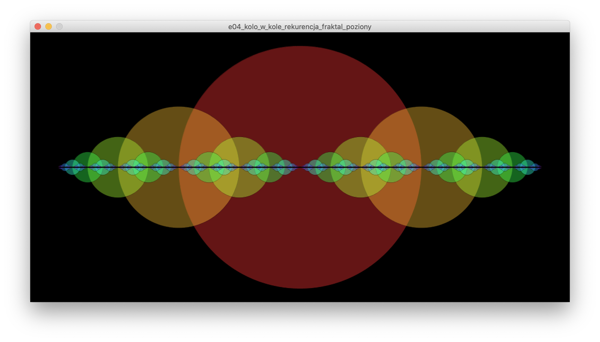
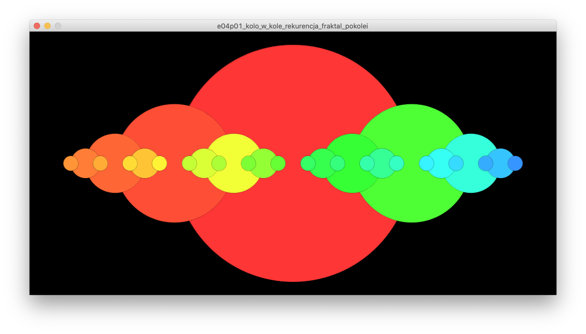
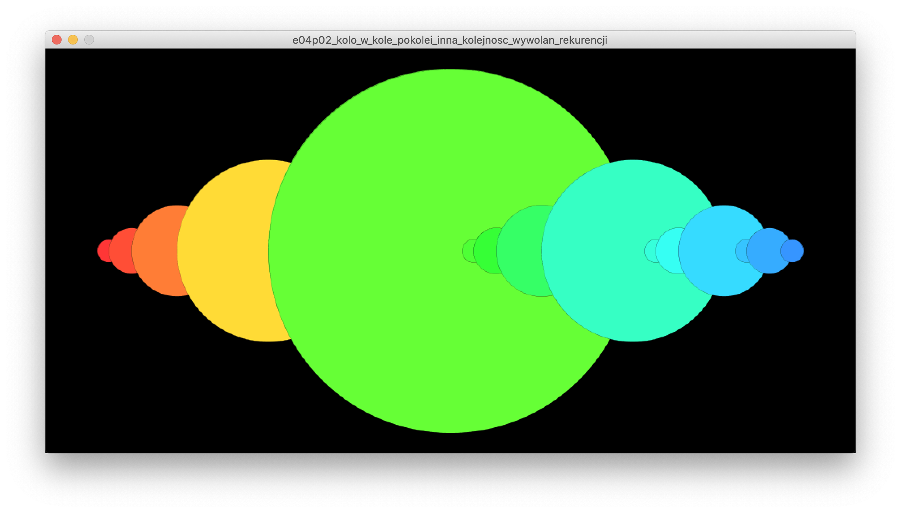
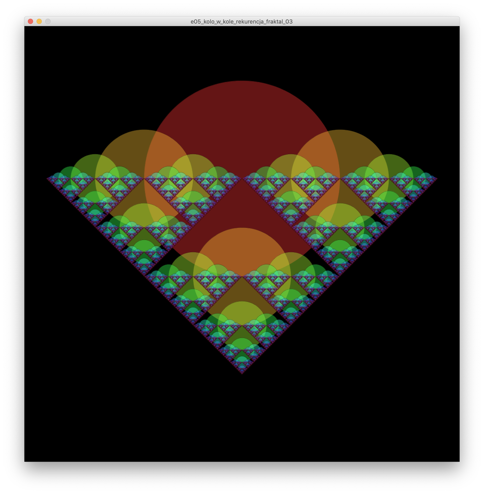
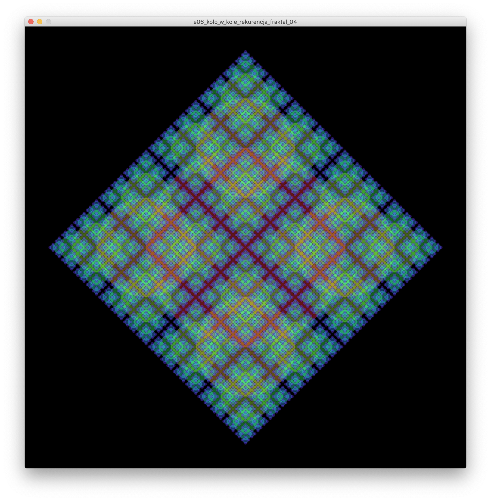
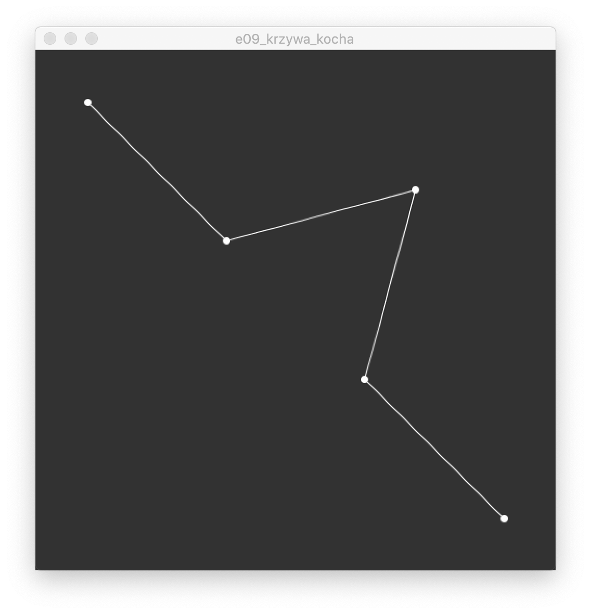

# Sezon 08 - rekurencja i fraktale

## Processing

- **Tworzenie struktury kodu za pomocą funkcji**, 
na przykładzie konstruowania twarzy z obrysu, oczu i uszu. Tworzenie kodu za pomocą mniejszych kawałków (własnych poleceń /  instrukcji / funkcji) ułatwia tworzenie złożonych lub rozbudowanych struktur, oraz ułatwia późniejsze rozumienie wcześniej napisanego kodu.
```Processing
void obrysTwarzy(…) {
   ellipse(…);
   uszy(…);
}
void oko(…) {
   ellipse(…);
   ellipse(…);
}
void oczy(…) {
   oko(…);
   oko(…);
}
void ucho(…) {
   rect(…);
}
void uszy(…) {
   ucho(…);
   ucho(…);
}
void twarz(…) {
  obrysTwarzy(…);
  oczy(…);
}
``` 
- **PVector** czyli wektory w Processing 
- Twozenie nowego wektora o długości jeden i określonym kierunku
```Processing
//Nowy wektor długości 1 pod kątem 45 stopni
PVector v = PVector.fromAngle(radians(45));
```
- `PVector v = PVector.add(v1, v2);` wektor v to suma wektorów v1 i v2. Uwaga po operacji dodawania v1 i v2 są nie zmienione. 
- `v1.add(v2);` dodanie wektora v1 i v2. Po operacji v1 staje się sumą v1 i v2, natomiast v2 pozostaje niezmieniony 
- `v.mult(30);` wydłuża 30ci razy wektor v 
- `v.div(3);` skraca 3rzy razy wektor v
- `v.rotate(k);` obraca o kąt k (k w radianach) wektor v 
- `v.x` wyciąga z wektora współrzędną x, czyli wymiar wektora w osi x, albo inaczej rzut wektora na oś x. W praktyce stosujemy jak rysujemy końce wektorów punktami, albo linie łączące te końce.
- **Rekurencja** jako sposób na tworzenie struktur samo-osobnych przypominających fraktale.
- Jak działa wywołanie rekurencyjne na prostym przykładzie koła w kole, a potem w stronę fraktali (koła z kołami w kołach - WOW!).
```Processing
void kolo_w_kole(float x, float y, float d) {
	//tu jakiś kod rysujący to koło
	circle(x, y, d);
	//a potem wywołanie rekurencyjne
	//czyli:
	//żeby narysować koło w kole
	//trzeba narysować mniejsze koło
	kolo_w_kole(x, y, d/2); 
} 
```

- Pierwszy poziom krzywej Kocha za pomocą PVector. Dzielimy, obracamy i dodajemy wektory. Wow i wychodzi z tego krzywa Kocha. 


## Praca domowa
Ułożyć krzywą Kocha tek by powstał płatek Kocha. Narazie zostajemy na pierwszym poziomie, czyli nie robimy rekurencji, tylko powielacie na bokach trójkąta równobocznego krzywą kocha z e09.

## Materiały dodatkowe

**Rekurencja i fraktale:**
- [The Nature of Code Chapter 8. Fractals](https://natureofcode.com/book/chapter-8-fractals/)
- [8.1: Fractals - The Nature of Code video](https://www.youtube.com/watch?v=-wiverLQl1Q)
-  [8.2: Fractal Recursion - The Nature of Code video](https://youtu.be/s3Facu6ZVeA)
- [Fraktal wiki](https://en.wikipedia.org/wiki/Fractal)

**Wektory:**
- [1.1: Vectors - The Nature of Code video](https://youtu.be/mWJkvxQXIa8)
- [PVector](https://processing.org/tutorials/pvector/)

**Książki**
- [Granice chaosu: fraktale część 1, Heinz-Otto Peitgen , Dietmar Saupe , Hartmunt Jürgens](https://merlin.pl/granice-chaosu-fraktale-czesc-1-hartmunt-jrgens-heinz-otto-peitgen-dietmar-saupe/1327261/)
- [Granice chaosu. Fraktale - część 2](https://merlin.pl/granice-chaosu-fraktale-czesc-2-hartmut-jurgens-heinz-otto-peitgen-dietmar-saupe/1757950/)


## Ekrany

Rekurencja koła w kołach podwójnie rozgałęzione z poziomami rekurencji pokolorowanymi przez powiązanie Hue z poziomem.



Rekurencja koła w kołach podwójnie rozgałęzione z ponumerowanymi rysunkami kół w kolejności ich rysowania. Numer rysunku staje się jego kolorem przez powiązanie z Hue.



- Jak powyżej, jedyne co zmieniliśmy to kolejność wywołań rekurencyjnych 
z:
— rysuj siebie, rysuj lewe koło, rysuj prawe koło,
na:
— rysuj lewe koło, rysuj siebie, rysuj prawe koło



Rekurencja koła w kołach potrójnie rozgałęzione z poziomami rekurencji pokolorowanymi przez powiązanie Hue z poziomem. 



Rekurencja koła w kołach poczwórnie rozgałęzione z poziomami rekurencji pokolorowanymi przez powiązanie Hue z poziomem. 



Krzywa Kocha pierwszy poziom rekurencji. Dzielimy, obracamy i dodajemy wektory. Wow i wychodzi z tego krzywa Kocha. 


