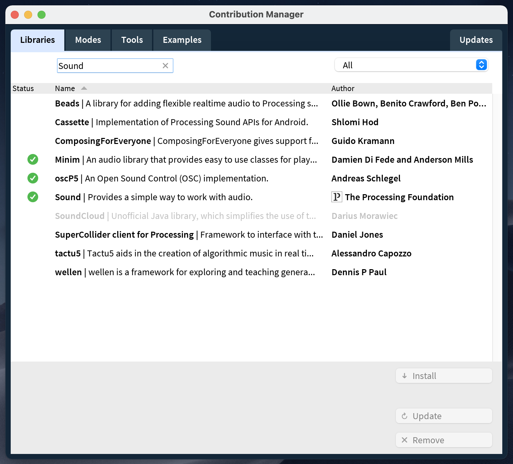

# Sezon 09 - obiekty w ruchu i zdarzenia dźwiękowe

W ramach zajęć stworzyliśmy prostą symulację, w której stworzyliśmy autonomicznie poruszające się obiekty.

Obiekty podążają za jednym z punktów, którym możemy sterować za pomocą zdarzeń wywoływanych za pomocą klawiatury.
W momencie interakcji punktu z obiektem, następuje zdarzenie dźwiękowe.
Jednocześnie dadany został mechanizm, w którym przy pomocy głosu (za pośrednictwem mikrofonu) możemy wywoływać określone zdarzenia.

## Poruszone zagadnienia:

- użycie obiektów
- obsługa zdarzeń klawiatury
- biblioteki
- obsługa mikrofonu
- obsługa zdarzeń dźwiękowych

### Użycie obiektów

Przy pomocy tablicy `squares` tworzymy 3 obiekty typu `Square`.

UWAGA: utworzenie tablicy nie oznacza, że jest już ona automatycznie wypełniona tymi obiektami. W tym momencie jedynie deklarujemy, ile obiektów danego typu (tutaj `Squares`) określona tablica może przyjąć (tutaj `3`)

```Processing
Square[] squares = new Square[3];
```

Następnie dodajemy do tablicy obiekty.

```Processing
squares[0] = new Square(20, 20, 10);
squares[1] = new Square(80, 50, 5);
squares[2] = new Square(50, 80, 8);
```

Obiekty możemy umieścić w tym samym pliku Processing (`.pde`).

```Processing
Square[] squares = new Square[3];

void setup() {
  squares[0] = new Square(20, 20, 10);
  squares[1] = new Square(80, 50, 5);
  squares[2] = new Square(50, 80, 8);
}

void draw() {
  for (int i = 0; i < squares.length; i++) {
    squares[i].display();
  }
}

class Square {
  float x;
  float y;
  float size;

  Square(float ix, float iy, float s) {
    x = ix;
    y = iy;
    size = s;
  }

  void display() {
    rect(x, y, size, size);
  }
}
```

Możemy również umieścić definicję obiekty w osobnym pliku, który umieszczamy w tym samym katalogu co główny plik.


#### Plik Demo.pde

```Processing
Square[] squares = new Square[3];

void setup() {
  squares[0] = new Square(20, 20, 10);
  squares[1] = new Square(80, 50, 5);
  squares[2] = new Square(50, 80, 8);
}

void draw() {
  for (int i = 0; i < squares.length; i++) {
    squares[i].display();
  }
}
```

#### Plik Square.pde

```Processing
class Square {
  float x;
  float y;
  float size;

  Square(float ix, float iy, float s) {
    x = ix;
    y = iy;
    size = s;
  }

  void display() {
    rect(x, y, size, size);
  }
}
```

### Obsługa zdarzeń klawiatury

Obsługa zdarzeń za pomocą klawiatury została omówiona podczas zajęć [S06 - analiza ruchu oparta na zdarzeniach](../s06%20-%20analiza%20ruchu%20oparta%20na%20zdarzeniach/).

### Biblioteki

Processing posiada dwa typy bibliotek. Wbudowane (ang. core), które rozszerzają możliwości Processingu w obszarze dźwięku, obrazu, wideo oraz komunikacji z innymi urządzeniami.

Drugim rodzajem są biblioteki współtworzone przez członków społeczności Processing (ang. contributed). Wszystkie są oparte na otwartych licencjach (open source) i zazwyczaj zawierają własne odniesienia i przykłady.

Aby dodać nową bibliotekę należy z menu głównego Processing wybrać `Sketch` → `Import Library...` → `Add Library...`.


Następnie wyszukujemy po nazwie interesującą nas bibliotekę. Po jej wybraniu należy ją dodać do Processing za pomocą przycisku `↓ Install`.



### Obsługa mikrofonu

UWAGA: Używając starszej wersji Processing (mniejszej niż 4) systemach MacOS 11 lub 12 należy uruchomić Processing z aplikacji Terminal używając następujących poleceń:

```
# tell OSX to de-quarantine the sound and/or video library
xattr -r -d com.apple.quarantine ~/Documents/Processing/libraries/sound/*
xattr -r -d com.apple.quarantine ~/Documents/Processing/libraries/video/*

# start processing
/Applications/Processing.app/Contents/MacOS/Processing

# now RUN A SKETCH that requires audio/video input, and grant capturing permission when asked

sketchbook → libraries/sound/examples/IO/AudioInput
```

W przypadku używania Processing w wersji 4 i nowszej problemu tego być nie powinno.

Na samym początku należy zaimportować wymaganą bibliotekę (Sound).

```Processing
import processing.sound.*;
```

Aby udostępnić zbierania danych z mikrofonu należy użyć `AudioIn(this, 0)`, gdzie 0 oznacza 1 kanał.
Następnie komendą `input.start()` rozpoczynamy przechwytywanie informacji z mikrofonu.

```Processing
AudioIn input = new AudioIn(this, 0);
input.start();
```

Kolejnym krokiem jest podłączenie danych z mikrofonu z analizatorem, który oblicza średnią kwadratową amplitudy każdego bloku audio i zwraca tę wartość.

```Processing
Amplitude loudness = new Amplitude(this);
loudness.input(input);
```

Ostatnim krokiem jest odczyt wartości. Znajduje się on w przedziale od `0.0` do `1.0`, więc w razie potrzeby możemy go zmapować na inne wartości.

```Processing
void draw() {
  float volume = loudness.analyze();
  float size = map(volume, 0.0, 1.0, 0, 500);
}
```

## Obsługa zdarzeń dźwiękowych

W celu odtworzenia zdarzenia dźwiękowego można użyć `SoundFile`. Dostępne formaty pliku audio to `WAV`, `AIF/AIFF` oraz `MP3`.

```Processing
import processing.sound.*;

SoundFile file;

void setup() {
  file = new SoundFile(this, "knock.wav");
}

void draw() {
}

void keyPressed() {
  if (file.isPlaying() == false) {
    file.play();
  }
}
```

## Materiały pomocnicze

- [Biblioteki](https://processing.org/reference/libraries/)
- [Obiekty](https://processing.org/tutorials/objects)
- [Obsługa klawiatury](https://processing.org/reference#input-keyboard)
- [Obsługa zdarzeń dźwiękowych](https://processing.org/reference/libraries/sound/index.html)
- [Odtwarzanie dźwięku](https://processing.org/reference/libraries/sound/SoundFile.html)
- [Tablice](https://processing.org/reference/Array.html)