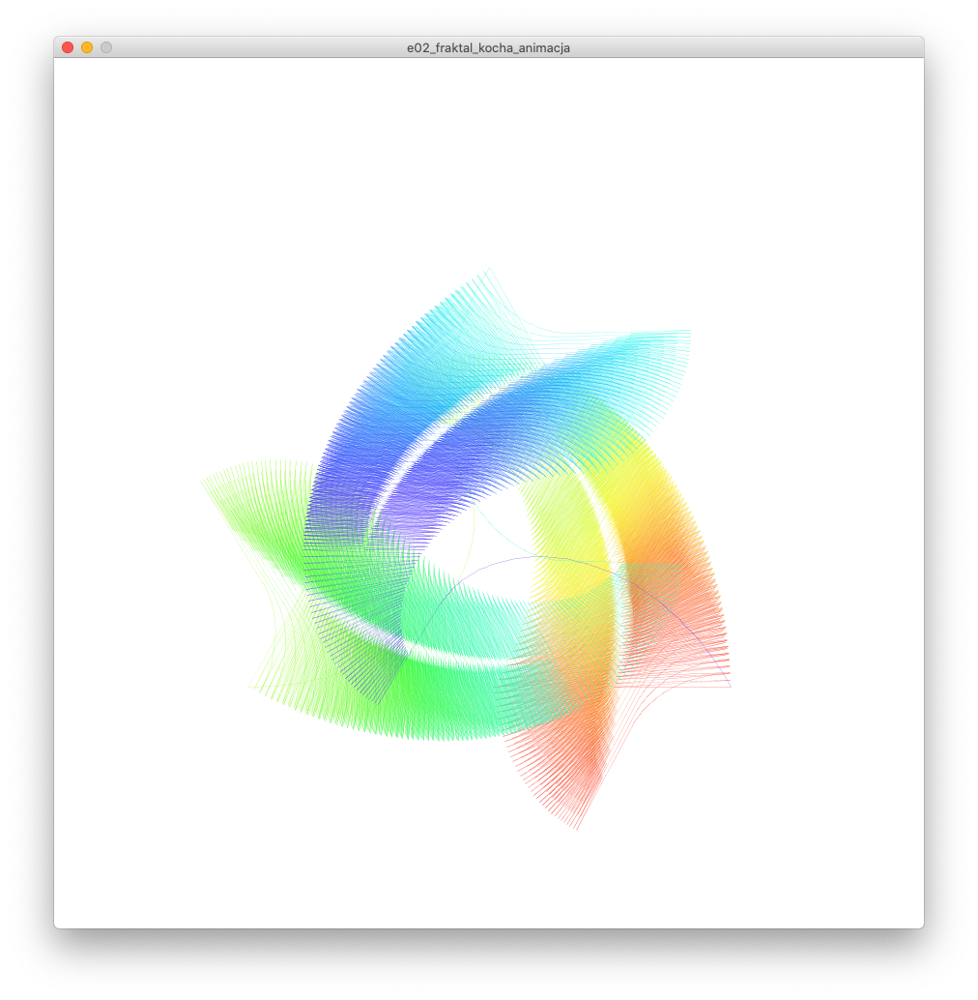

# Sezon 09 - płatki i dywany

## Processing

- **PVector** czyli wektory w Processing 
- Twozenie nowego wektora o długości jeden i określonym kierunku
```Processing
//Nowy wektor długości 1 pod kątem 45 stopni
PVector v = new PVector(radians(45));
```
- `PVector v = PVector.add(v1, v2);` wektor v to suma wektorów v1 i v2. Uwaga po operacji dodawania v1 i v2 są nie zmienione. 
- `PVector v = PVector.sub(v1, v2);` wektor v to różnica wektorów v1 i v2. Uwaga po operacji v1 i v2 są nie zmienione. 
- `v1.add(v2);` dodanie wektora v1 i v2. Po operacji v1 staje się sumą v1 i v2, natomiast v2 pozostaje niezmieniony 
- `v.mult(30);` wydłuża 30ci razy wektor v 
- `v.div(3);` skraca 3rzy razy wektor v
- `v.rotate(k);` obraca o kąt k (k w radianach) wektor v 
- `v.rotate(k).(radians(45));` obraca o kąt 45 stopni. 
- `v.x` wyciąga z wektora współrzędną x, czyli wymiar wektora w osi x, albo inaczej rzut wektora na oś x. W praktyce stosujemy jak rysujemy końce wektorów punktami, albo linie łączące te końce.

- **Rekurencja** jako sposób na tworzenie struktur samo-osobnych przypominających fraktale.
- Było jak działa wywołanie rekurencyjne na prostym przykładzie koła w kole, a potem w stronę fraktali (koła z kołami w kołach - WOW!).
```Processing
void kolo_w_kole(float x, float y, float d) {
	//tu jakiś kod rysujący to koło
	circle(x, y, d);
	//a potem wywołanie rekurencyjne
	//czyli:
	//żeby narysować koło w kole
	//trzeba narysować mniejsze koło
	kolo_w_kole(x, y, d/2); 
} 
```

- A w sezonie 9 idziemy dalej i tworzymy klasyczne fraktale. Krzywa Kocha a potem dywan Sierpińskiego. 

- Pierwszy poziom krzywej Kocha za pomocą PVector. Dzielimy, obracamy i dodajemy wektory. Wow i wychodzi z tego krzywa Kocha. 

- Kontynuujemy tworzenie rekurencyjnie krzywej Kocha. Zaczynamy od pierwszego poziomu krzywej Kocha stworzonego za pomocą `PVector`, na poprzednich zajęciach.
- Zamieniamy krzywą Kocha pierwszego poziomu w funkcję. 
- Parametr funkcji może być obiektem! Wykorzystujemy to przy tworzeniu funkcji:
  
```Processing
void Koch(PVector poczatek, PVector koniec) {
  …
} 
```

- Tworzymy rekurencyjną wersje krzywej Kocha.
- Tworzymy płatek Kocha, mamy fraktal!
- Dodajemy losowe zniekształcenia kątów i podziałów.

- Mała modyfikacja sposobu wyliczania punktów i kątów w płatku Kocha i powstaje Cesàro Fractal :D 

- Polski akcent na koniec, czyli dywan Sierpińskiego

## Praca domowa
Proszę za pomocą rekurencji stwórzcie własny fraktal. Może być modyfikacją płatka Kocha, ale zachęcamy do stworzenia nowego na podstawie inspiracji z materiałów dodatkowych. :)

## Materiały dodatkowe

**Rekurencja i fraktale:**
- [The Nature of Code Chapter 8. Fractals](https://natureofcode.com/book/chapter-8-fractals/)
- [8.1: Fractals - The Nature of Code video](https://www.youtube.com/watch?v=-wiverLQl1Q)
-  [8.2: Fractal Recursion - The Nature of Code video](https://youtu.be/s3Facu6ZVeA)
- [Fraktal wiki](https://en.wikipedia.org/wiki/Fractal)

**Wektory:**
- [1.1: Vectors - The Nature of Code video](https://youtu.be/mWJkvxQXIa8)
- [PVector](https://processing.org/tutorials/pvector/)

**Wektory obrazowo wyjaśnione:** 
- [Introduction to Vectors](https://youtu.be/_YkIivLaVJs)
- [Vectors | Khan Academy](https://youtu.be/br7tS1t2SFE)

**Fraktale - inspiracje:**
- [Dywan Sierpińskiego](http://www.mini.pw.edu.pl/MiNIwyklady/fraktale/Dywan/dywan.html)
- [Zbiór Cantora](https://pl.wikipedia.org/wiki/Zbiór_Cantora)
- [Koch Snowflake](http://mathworld.wolfram.com/KochSnowflake.html)
- [Trójkąt Sierpińskiego](http://www.mini.pw.edu.pl/MiNIwyklady/fraktale/Trojkat/trojkat.html)
- [Box Fractal](http://mathworld.wolfram.com/BoxFractal.html)
- [Koch Antisnowflake](http://mathworld.wolfram.com/KochAntisnowflake.html)
- [Cesàro Fractal](http://mathworld.wolfram.com/CesaroFractal.html)
- [Cross-Stitch Curve](http://mathworld.wolfram.com/Cross-StitchCurve.html)

**Książki:**
- [Granice chaosu: fraktale część 1, Heinz-Otto Peitgen , Dietmar Saupe , Hartmunt Jürgens](https://merlin.pl/granice-chaosu-fraktale-czesc-1-hartmunt-jrgens-heinz-otto-peitgen-dietmar-saupe/1327261/)
- [Granice chaosu. Fraktale - część 2](https://merlin.pl/granice-chaosu-fraktale-czesc-2-hartmut-jurgens-heinz-otto-peitgen-dietmar-saupe/1757950/)

## Ekrany

Dodajemy losowe zniekształcenia kątów i podziałów. Efekt WoW!


