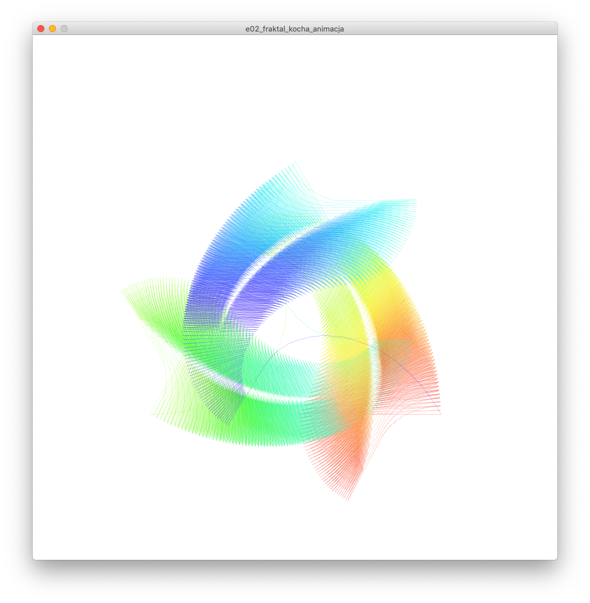

# Sezon 09 - Płatek Kocha

## Processing

- Kontynuujemy tworzenie rekurencyjnie krzywej Kocha. Zaczynamy od pierwszego poziomu krzywej Kocha stworzonego za pomocą `PVector`, na poprzednich zajęciach.
- Zamieniamy krzywą Kocha pierwszego poziomu w funkcję. 
- Parametr funkcji może być obiektem! Wykorzystujemy to przy tworzeniu funkcji:
  
```Processing
void krzywaKocha(PVector poczatek, PVector koniec) {
  …
} 
```

- Tworzymy rekurencyjną wersje krzywejKocha.
- Tworzymy płatek Kocha, mamy fraktal!
- Dodajemy losowe zniekształcenia kątów i podziałów.

## Praca domowa
Proszę za pomocą rekurencji stwórzcie własny fraktal. Może być modyfikacją płatka Kocha, ale zachęcamy do stworzenia nowego na podstawie inspiracji z materiałów dodatkowych. :)

## Materiały dodatkowe

**Fraktale - inspiracje**
- [Dywan Sierpińskiego](http://www.mini.pw.edu.pl/MiNIwyklady/fraktale/Dywan/dywan.html)
- [Zbiór Cantora](https://pl.wikipedia.org/wiki/Zbiór_Cantora)
- [Koch Snowflake](http://mathworld.wolfram.com/KochSnowflake.html)
- [Trójkąt Sierpińskiego](http://www.mini.pw.edu.pl/MiNIwyklady/fraktale/Trojkat/trojkat.html)
- [Box Fractal](http://mathworld.wolfram.com/BoxFractal.html)
- [Koch Antisnowflake](http://mathworld.wolfram.com/KochAntisnowflake.html)
- [Cesàro Fractal](http://mathworld.wolfram.com/CesaroFractal.html)
- [Cross-Stitch Curve](http://mathworld.wolfram.com/Cross-StitchCurve.html)


**Książki:**
- [Granice chaosu: fraktale część 1, Heinz-Otto Peitgen , Dietmar Saupe , Hartmunt Jürgens](https://merlin.pl/granice-chaosu-fraktale-czesc-1-hartmunt-jrgens-heinz-otto-peitgen-dietmar-saupe/1327261/)
- [Granice chaosu. Fraktale - część 2](https://merlin.pl/granice-chaosu-fraktale-czesc-2-hartmut-jurgens-heinz-otto-peitgen-dietmar-saupe/1757950/)


## Ekrany

Dodajemy losowe zniekształcenia kątów i podziałów. Efekt WoW!



