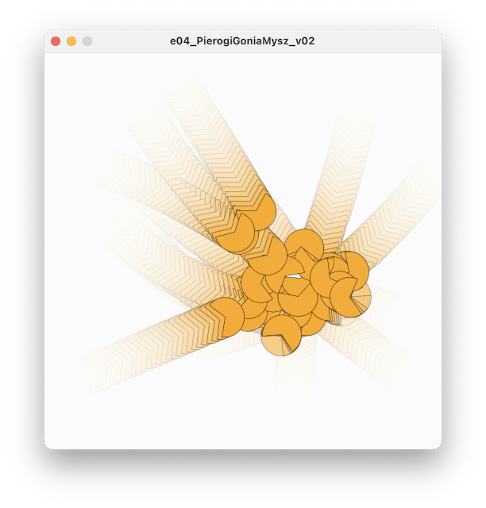
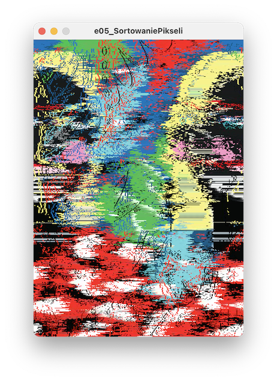

# Sezon 10 - wektory i sortowanie pikseli

## Processing

- **PVector** czyli wektory w Processing 
- Twozenie nowego wektora o długości jeden i określonym kierunku
```Processing
//Nowy wektor długości 1 pod kątem 45 stopni
PVector v = new PVector(radians(45));
```
- `PVector v = PVector.add(v1, v2);` wektor v to suma wektorów v1 i v2. Uwaga po operacji dodawania v1 i v2 są nie zmienione. 
- `PVector v = PVector.sub(v1, v2);` wektor v to różnica wektorów v1 i v2. Uwaga po operacji v1 i v2 są nie zmienione. 
- `v1.add(v2);` dodanie wektora v1 i v2. Po operacji v1 staje się sumą v1 i v2, natomiast v2 pozostaje niezmieniony 
- `v.mult(30);` wydłuża 30ci razy wektor v 
- `v.div(3);` skraca 3rzy razy wektor v
- `v.rotate(k);` obraca o kąt k (k w radianach) wektor v 
- `v.rotate(k).(radians(45));` obraca o kąt 45 stopni. 
- `v.x` wyciąga z wektora współrzędną x, czyli wymiar wektora w osi x, albo inaczej rzut wektora na oś x. W praktyce stosujemy jak rysujemy końce wektorów punktami, albo linie łączące te końce.


**Bonus.** Obejście problem skasowania okra do rozmiaru wgranej grafiki. 

```Processing
  Grafika = loadImage("grafika.jpg");
  this.surface.setSize(Grafika.width, Grafika.height);
```

## Materiały dodatkowe

**Wektory:**
- [1.1: Vectors - The Nature of Code video](https://youtu.be/mWJkvxQXIa8)
- [PVector](https://processing.org/tutorials/pvector/)

**Wektory obrazowo wyjaśnione:** 
- [Introduction to Vectors](https://youtu.be/_YkIivLaVJs)
- [Vectors | Khan Academy](https://youtu.be/br7tS1t2SFE)


## Ekrany

Pierogi sterowane wektorowo zgromadzone w `ArrayList`



Sortowanie pikseli

