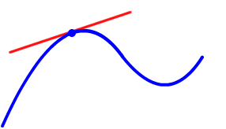
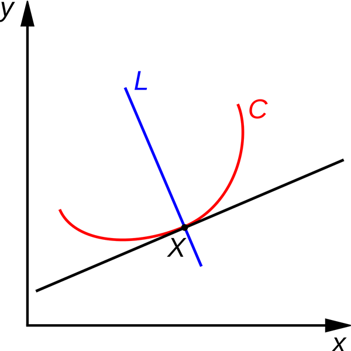

# Sezon 11 - Geomerative pt. 1

Prezentacja wykorzystania biblioteki Geomerative
do bardziej zaawansowanych operacji na kształtach wektorowych w kontekście typografii.

## Poruszone zagadnienia:

- instalowanie zewnętrznej biblioteki
- intro do Geomerative
- stworzenie wektorowego kształtu na podstawie tekstu
- dekonstrukcja tekstu na składowe - litery, kształty, ścieżki, punkty
- obliczanie punktu na ścieżce
- styczne i normalne ścieżek

### GEOMERATIVE

Należy pamietać zaimportowaniu oraz zainicjalizowaniu biblioteki w setup.

```Processing
import geomerative.*; // import biblioteki

void setup(){
	size(800,600);
    RG.init(this); // metoda inicjalizujaca biblkotekę
}
```

#####Podstawowe typy obiektów:

- `RShape` - odpowiednik `PShape` - wektorowy kształt złożony z wielu krzywych, i/lub kolekcja (grupa) inych `PShape` znajdujacych sie we własciowości `children`. Każdy obiekt `RShape` składa się bezposrednio z kolekcji obiektów typu `RPath`:

- `RPath` - ścieżka skłądajaca się z kolekcji krzywych. Posiada przydatne metodty pozwalajace olbiczyc punkt znajdujacy sie w danym procencie dł. danej ściezli - metoda `getPoint()` oraz tzw. stycznej - metoda `getTangent()`

- `RPoint` - odpowiednik `PVector` - czyli punkt w 2D posiadajacy wlaściwość `x` i `y` jak również kolekcję metod do operacji na wektorach.

#####Polygonizer

Geomerative posiada kolekcje algorytmów pozwalajacych zamienić krzywe na sekwencje odcinków prostych (przydaje sie to np. do deformacji kształtów). Mamy do dyspozycji 3 algorytmy:

- `RG.UNIFORMSTEP` - tnie krzywą na X odcinków, niezależnie od jej długości, dlatego kró†sze odcinki beda pociete "gęściej" a dłuższe "rzadziej"

- `RG.UNIFORMLENGTH` - tnie krzywą na odcinki zddanej dł. - to pozwala uzyskać bardziej równomoerna dystrybucje odcinków, niezależna od dł. poszczegłólnych krzywych.

- `RG.ADAPTATIVE` - najabrdziej "inteligentny" algorytm tnacy krzywe na wieksza ilosc segmentów tam gdzie potrzeba wiecej detali - np. ostre łuki a tam gdzie są de facto odcinki proste pozostawia rzeczy bez zmian.

Przykałd użycia:

```Processing
import geomerative.*; 

void setup(){

	size(800,600);
    RG.init(this);
    
    // ustawienie trybu polygonizera za pomoca metody globalnego obiektu RG - tu na UNIFORMSTEP
    RG.setPolygonizer(RG.UNIFORMLENGTH);
}

void draw(){
	
    // ustawiamy "gęstość" cięcia - tu de facto ilość cięć na krzywa w zakresie 2-20 na podstawie polozenia kursora myszy...
    RG.setPolygonizerLength( map( mouseX, 0, width, 2, 20 ) );

}
```

#####Styczne i normalne

- Styczna - to linie prosta mająca jeden punkt wspólny z linią krzywą, np. okręgiem, i nieprzecinająca jej



- Normalna - to linia prosta przecinajaca krzywą w danym jej punkcie pod kątem prostym - normalna jest zawsze prostopadła do stycznej



## Materiały pomocnicze

- [Geomerative](http://www.ricardmarxer.com/geomerative/)
- [Dokumentacja Geomerative](http://www.ricardmarxer.com/geomerative/documentation/index.html)

## Praca domowa
Rozwinac ostatnie przykąłdy z zajec z wykorzystaniem `getTangent`, `getPoint` lub polygonizera, można np. dodc interakcje z myszą, dźwiękiem (z poprzednich zajec). Poeksperymentować z rysowaniem linii pomiedzy radomowymi punktami na ściezkach liter. Trochę inspiracji tutaj - https://pl.pinterest.com/search/pins/?q=generative%20typography
