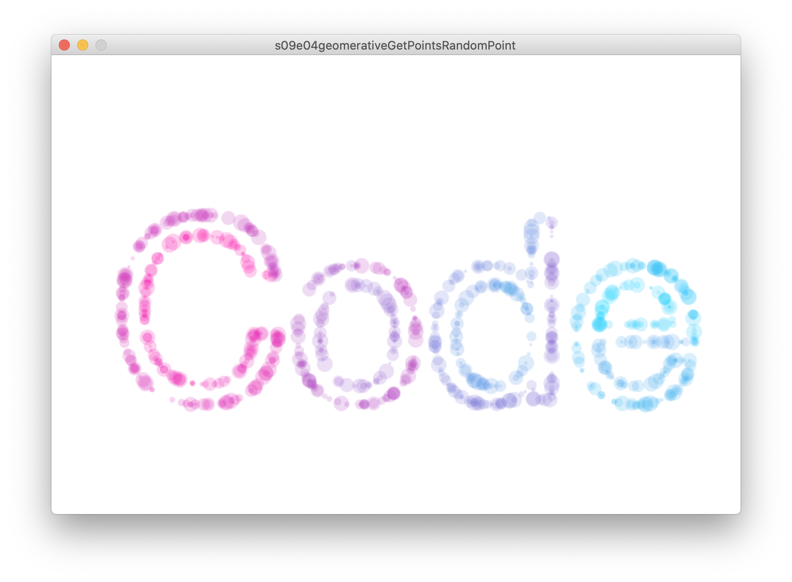
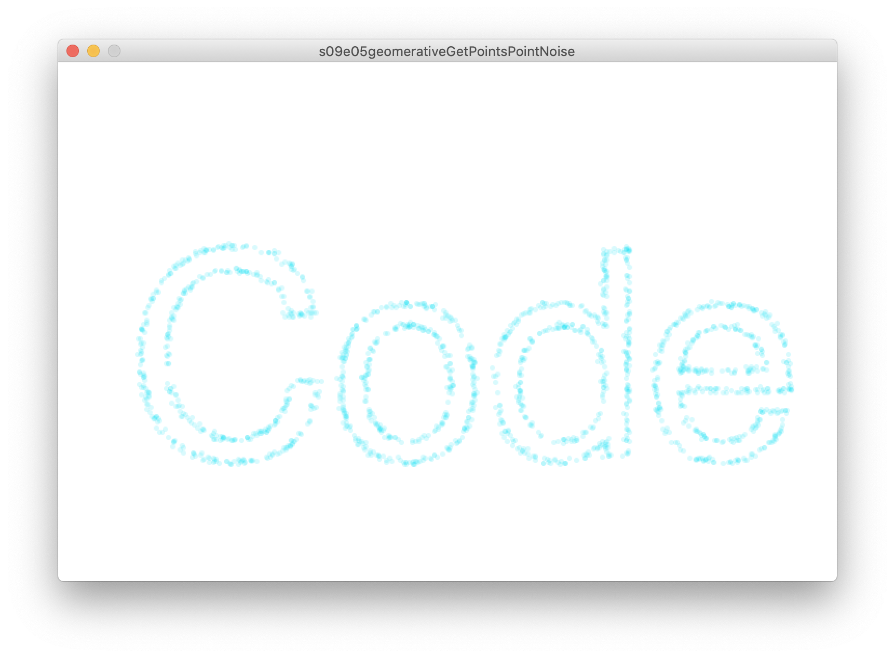
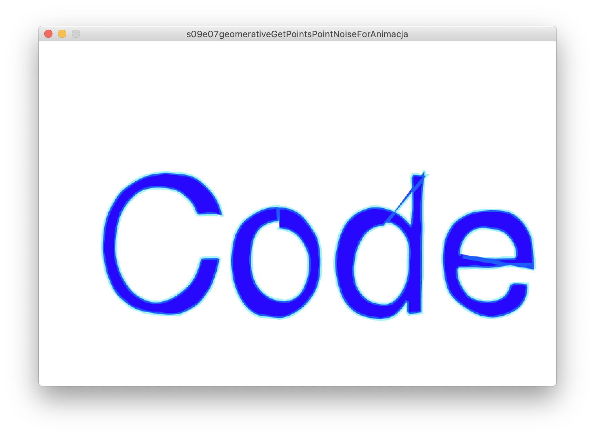

# Sezon 14 - Geomerative część 1

## Processing
- Geomerative: importowanie biblioteki
- Geommerative: inicjalizacja ```RG.init()```
- Geomerative: podstawowe typy obiektów - RShape, RPoint
- Geomerative: tworzenie kształtów z tekstu:
```RG.getText("Hello world!", "FreeSans.ttf", 72, CENTER);```
- Geomerative: znjdowanie centrum kształtu i rotacja ```napis.children[0].rotate(PI/20, napis.children[0].getCenter());```
- Geomerative: znajdowanie punktów na orysach kształtów liter (RShape) ```points = napis.getPoints()```
- Geomerative: rysowanie linii na podstawie punktów, różne warianty
- Dodatkowo: ```noise()``
- Dodatkowo: czym jest specjalna wartość ```null``` i kiedy/jak go używać

## Zadanie domowe
Na podstawie przerabianaych przykładów zrobić kompozycję typograficzną. Wykorzystać obrysy liter i punkty jako źródło do generowania nowych form.

## Materiały pomocnicze
- [DOKUMENTACJA GEOMERATIVE](http://www.ricardmarxer.com/geomerative/documentation)
- [GEOMERATIVE: PROGRAMMING DESIGN SYSTEMS](http://printingcode.runemadsen.com/geomerative/)
- [NOISE wyjaśniony przez Shiffmana](https://www.youtube.com/watch?v=8ZEMLCnn8v0)
- [DOKUMENTACJA PROCESSING czym jest `null`](https://processing.org/reference/null.html)

## Inspiracje
- https://pl.pinterest.com/jkozniewski/generotype/

## Ekrany

Pobieramy listę punktów równomiernie rozłożonych na obrysie tekstu, a potem losujemy, który z nich narysować i rysujemy w miejscu x, y wylosowanego punktu z losowym rozmiarem i kolorem zmapowanym za pomocą `lerpColor()`



Pobieramy listę punktów równomiernie rozłożonych na obrysie tekstu, a potem losujemy, który z nich narysować i rysujemy w miejscu x, y wylosowanego punktu z zaburzeniem położenia za pomocą `noise()`



 Pobieramy listę punktów równomiernie rozłożonych na obrysie tekstu, a potem odtwarzamy w każdej klatce animacji cały obrys napisu za pomocą `beginShape()` `endShape()` delikatnie modyfikujące położenia punktów z obrysu za pomocą `noise()` tak, że dostajemy wrażenie „pływania” obrysu.


