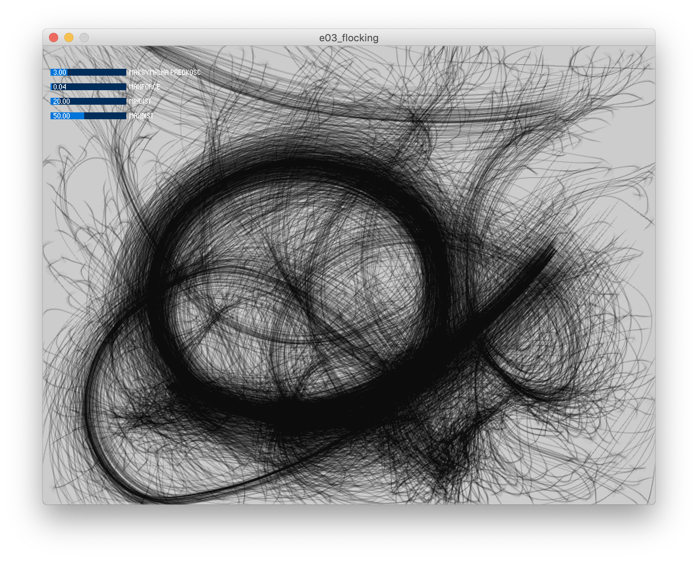

# Sezon 11 - ArrayList i Flocking

## Processing

`ArrayList` jest koncepcyjnie podobny do znanej już wam Array, z tą miłą różnicą, że rozmiar tablicy może się zmieniać dynamicznie, czyli można dodawać i usuwać elementy tablicy w trakcie działania programu. Co więcej `ArrayList` jest obiektem :D

```Processing

//deklaracja nieco dzika
//bo mamy co tablica lista przechowuje
//umieszczone pomiędzy <>
ArrayList<PVector> particles;
//a tak tworzymy obiekt tablicy listy
particles = new ArrayList<PVector>();
//nowe elementy do tablicy listy dodajemy
particles.add(p);
//a tak je pobieramy z indeksu i
PVector p = particles.get(i);
//a tak usuwamy
particles.remove(i);
//a tak sprawdzamy rozmiar tablicy listy
if(particles.size()>0) …

```

`ArrayList` jest bardzo pomocny przy tworzeniu symulacji zjawisk naturalnych. Pokazaliśmy jak zrobić symulację stada w przykładzie Flocking.

## Materiały dodatkowe

- [ArrayList](https://processing.org/reference/ArrayList.html)
- [Nature of Code - Flocking](https://natureofcode.com/book/chapter-6-autonomous-agents/#613-flocking)
- [ControlP5](http://www.sojamo.de/libraries/controlP5/)

## Ekrany

Flocking za pomocą `ArrayList` `PVector` i programowania obiektowego

